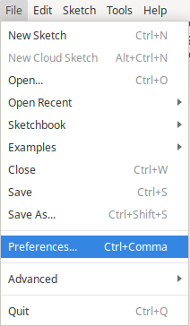
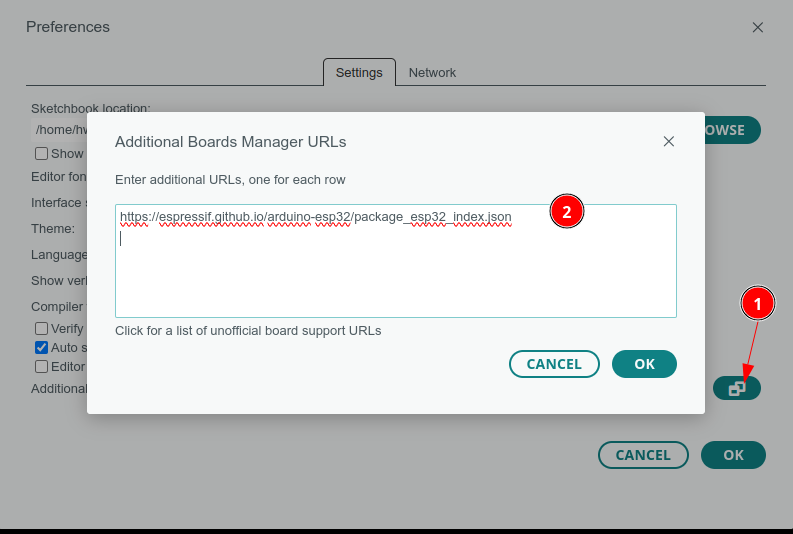
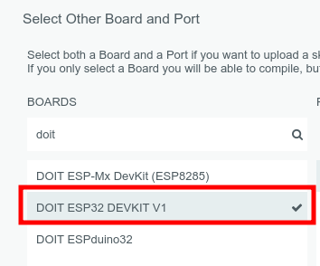

# Modul ESP32 Basic Startkit IOT 


# Modul ESP32 doit esp32


# Note ESP32
- Pada ESP32, ADC2 digunakan oleh modul Wi-Fi untuk keperluan internal, yang dapat memengaruhi pembacaan dari beberapa channel ADC2. Secara khusus, channel ADC2 yang digunakan oleh Wi-Fi adalah:
   - ADC2_CHANNEL_0 (GPIO4)
   - ADC2_CHANNEL_2 (GPIO2)
   - ADC2_CHANNEL_4 (GPIO13)
   - ADC2_CHANNEL_5 (GPIO12)
   - ADC2_CHANNEL_6 (GPIO14)

- Pada ESP32 DOIT Devkit V1, beberapa pin tidak bisa digunakan sebagai GPIO output karena memiliki fungsi khusus atau dibatasi oleh desain perangkat keras. Selain VCC dan GND, pin-pinnya yang tidak dapat digunakan sebagai GPIO output meliputi:

  - GPIO1 (TX0) dan GPIO3 (RX0): Digunakan sebagai pin TX dan RX untuk komunikasi serial (UART0). Mengubah fungsi GPIO mereka dapat mengganggu komunikasi serial, terutama saat boot.
  - GPIO6 hingga GPIO11: Digunakan sebagai pin untuk jalur bus SPI flash. Mereka terhubung ke memori flash dan tidak dapat digunakan sebagai GPIO output.
  - GPIO16 dan GPIO17: Biasanya digunakan untuk fungsionalitas yang terkait dengan Wi-Fi dan Bluetooth serta digunakan untuk komunikasi internal dan pemrograman. Mereka juga tidak selalu dapat digunakan sebagai GPIO output.
  - GPIO34, GPIO35, GPIO36, dan GPIO39: Biasanya digunakan sebagai input ADC. Walaupun beberapa dari pin ini bisa diprogram sebagai GPIO input, mereka seringkali tidak dapat digunakan sebagai GPIO output atau memiliki batasan dalam penggunaannya.

# Tutorial  ESP32 DOIT DevKit V1 30 Pin dengan Arduino IDE

## Daftar Isi

1. [Persiapan Perangkat Keras](https://www.notion.so/Modul-ESP32-Basic-Startkit-IOT-14ec8692d12f80318c2bd9a8837f0697?pvs=21)
2. [Instalasi Driver dan Arduino IDE](https://www.notion.so/Modul-ESP32-Basic-Startkit-IOT-14ec8692d12f80318c2bd9a8837f0697?pvs=21)
3. [Konfigurasi ESP32 di Arduino IDE](https://www.notion.so/Modul-ESP32-Basic-Startkit-IOT-14ec8692d12f80318c2bd9a8837f0697?pvs=21)
4. [Skema Koneksi](https://www.notion.so/Modul-ESP32-Basic-Startkit-IOT-14ec8692d12f80318c2bd9a8837f0697?pvs=21)
5. [Project Blinky](https://www.notion.so/Modul-ESP32-Basic-Startkit-IOT-14ec8692d12f80318c2bd9a8837f0697?pvs=21)
6. [Panduan Upload Kode](https://www.notion.so/Modul-ESP32-Basic-Startkit-IOT-14ec8692d12f80318c2bd9a8837f0697?pvs=21)
7. [Troubleshooting](https://www.notion.so/Modul-ESP32-Basic-Startkit-IOT-14ec8692d12f80318c2bd9a8837f0697?pvs=21)

## Persiapan Perangkat Keras

### Komponen yang Dibutuhkan

- ESP32 DOIT DevKit V1 30 Pin
- Kabel USB Tipe-C atau Micro USB
- Komputer/Laptop
- (Opsional) LED dan Resistor 220Ω untuk project Blinky

### Spesifikasi ESP32 DOIT DevKit V1 30 Pin

- Mikroprosesor: Dual-core Xtensa LX6
- Frekuensi Clock: Up to 240 MHz
- SRAM: 520 KB
- Flash: 4 MB
- Fitur Tambahan:
  - WiFi
  - Bluetooth Classic
  - Bluetooth Low Energy (BLE)
  - 30 Pin GPIO
  - Analog-to-Digital Converter (ADC)
  - Digital-to-Analog Converter (DAC)
  - Touch Sensors

## Instalasi Driver dan Arduino IDE

### Langkah 1: Unduh Arduino IDE

1. Kunjungi situs resmi Arduino: https://www.arduino.cc/en/software
2. Pilih versi sesuai sistem operasi Anda (Windows/macOS/Linux)
3. Unduh dan instal Arduino IDE

### Langkah 2: Instalasi Driver USB

## Windows

1. Hubungkan ESP32 ke komputer
2. Buka Device Manager
3. Cari port yang belum dikenali
4. Unduh driver CH340/CP2102 dari situs resmi produsen

## macOS

- Biasanya tidak memerlukan driver tambahan
- Gunakan kabel USB bawaan

## Linux

- Mayoritas distribusi Linux sudah mendukung secara langsung
- Jalankan perintah `sudo usermod -a -G dialout $USER` untuk izin akses port

## Konfigurasi ESP32 di Arduino IDE

### Langkah 1: Tambahkan Repositori ESP32

1. Buka Arduino IDE

2. Pergi ke File > Preferences



3. Di kolom "Additional Board Manager URLs", tambahkan:

   ```
   <https://espressif.github.io/arduino-esp32/package_esp32_index.json>
   ```



### Langkah 2: Instal Board ESP32

1. Buka Board Manager
   - Tools > Board > Board Manager

2. Cari "esp32"

3. Pilih "ESP32 by Espressif Systems"


4. Klik "Install"

### Langkah 3: Pilih Board

1. Tools > Board > ESP32 Arduino
2. Pilih "DOIT ESP32 DEVKIT V1"



## Skema Koneksi

### Koneksi LED untuk Blinky

- Gunakan GPIO2 (built-in LED pada beberapa board) atau Atau gunakan GPIO 16 untuk external LED

```
GPIO 16 ---- Resistor 220Ω ---- LED ---- GND
```

## Project Blinky

```cpp
#define LED_PIN 16//  atau GPIO 2 untuk Built-in LED

void setup() {
  pinMode(LED_PIN, OUTPUT);// Set pin LED sebagai output
}

void loop() {
  digitalWrite(LED_PIN, HIGH);// Nyalakan LED
  delay(1000);// Tunggu 1 detik
  digitalWrite(LED_PIN, LOW);// Matikan LED
  delay(1000);// Tunggu 1 detik
}
```

## Panduan Upload Kode

### Tombol Upload pada ESP32

ESP32 memiliki dua tombol penting untuk proses upload:

1. Tombol EN (Enable/Reset)
   - Berfungsi untuk me-reset modul
   - Tekan untuk me-restart ESP32
2. Tombol BOOT (GPIO 0)
   - Digunakan untuk mode bootloader
   - Ditekan saat upload kode

### Prosedur Upload Kode

1. Hubungkan ESP32 ke komputer
2. Pilih port COM yang benar
   - Tools > Port > Pilih port ESP32
3. Proses Upload:
   - Tekan dan tahan tombol BOOT
   - Sambil masih menekan BOOT, tekan tombol EN sebentar
   - Lepaskan tombol BOOT
4. Klik tombol Upload di Arduino IDE
5. Pastikan tekan Tombol EN agar program baru dijalankan

### Troubleshooting Upload

- Masalah Umum:
  - Gagal upload
  - Port tidak terdeteksi
  - Kegagalan koneksi
- Solusi:
  1. Periksa kabel USB
  2. Ganti kabel/port
  3. Instal ulang driver
  4. Pastikan urutan menekan tombol benar
  5. Restart Arduino IDE

## Troubleshooting

### Kode Tidak Terupload

- Pastikan tombol BOOT ditekan dengan benar
- Periksa driver USB
- Coba kabel USB lain
- Restart komputer

### LED Tidak Berkedip

- Periksa koneksi hardware
- Pastikan pin benar
- Periksa resistor
- Cek polaritas LED

### Koneksi Port Bermasalah

- Periksa Device Manager
- Update/Reinstall driver
- Coba port USB lain

## Tips Tambahan

- Selalu gunakan kabel data USB, bukan kabel charging
- Simpan dokumentasi pin ESP32 untuk referensi
- Gunakan external power bank jika diperlukan
- Backup project secara berkala

## Referensi Lanjutan

- Dokumentasi Resmi ESP32: https://docs.espressif.com/
- Arduino ESP32 GitHub: https://github.com/espressif/arduino-esp32