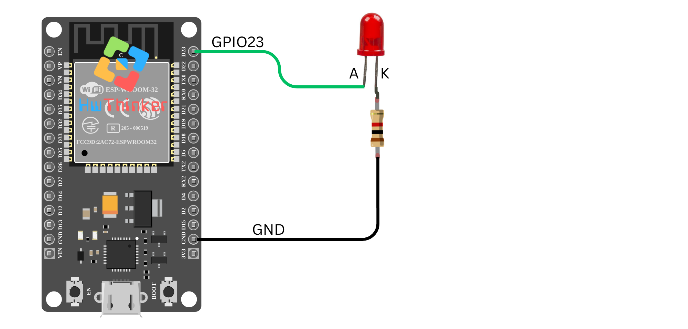

## 02: Blinky LED dengan ESP32

Pada tutorial ini, kita akan membuat program **blinky LED** sederhana menggunakan ESP32. LED akan menyala dan mati secara bergantian setiap detik, yang merupakan aplikasi dasar untuk memulai penggunaan pin GPIO pada ESP32.

### Alat dan Bahan yang Dibutuhkan:

- **ESP32** (misalnya ESP32 DevKit V1)
- **LED**
- **Resistor 220Ω**
- Kabel jumper
- Breadboard (opsional)

### Langkah-langkah:

1. **Persiapan dan Koneksi:**

   - Hubungkan LED ke **pin GPIO23** pada ESP32.
   - Gunakan resistor 220Ω untuk membatasi arus dan melindungi LED agar tidak rusak.
   - Pastikan LED terhubung ke ground (GND) melalui resistor.

   

2. **Kode Program:**

   ```c++
   #include <Arduino.h>
   
   // Definisikan pin LED
   #define LED_PIN1 23
   
   void setup() {
     // Atur pin LED sebagai output
     pinMode(LED_PIN1, OUTPUT);
   }
   
   void loop() {
     // Nyalakan LED
     digitalWrite(LED_PIN1, HIGH);  // Menyalakan LED (HIGH adalah tegangan positif)
     delay(1000);                    // Tunggu selama 1 detik
   
     // Matikan LED
     digitalWrite(LED_PIN1, LOW);   // Mematikan LED (LOW adalah tanpa tegangan)
     delay(1000);                    // Tunggu selama 1 detik
   }
   ```

3. **Penjelasan Kode:**

   - **`#define LED_PIN1 23`**: Mendefinisikan pin GPIO23 untuk LED. Anda bisa mengganti nomor pin ini sesuai dengan pin yang Anda gunakan.
   - **`pinMode(LED_PIN1, OUTPUT);`**: Mengatur pin GPIO23 sebagai output, karena kita akan mengendalikan LED melalui pin ini.
   - **`digitalWrite(LED_PIN1, HIGH);`**: Menyalakan LED dengan memberi sinyal tegangan tinggi (HIGH) pada pin GPIO23.
   - **`digitalWrite(LED_PIN1, LOW);`**: Mematikan LED dengan memberi sinyal tegangan rendah (LOW) pada pin GPIO23.
   - **`delay(1000);`**: Fungsi ini akan menghentikan eksekusi program selama 1000 milidetik (1 detik), yang menyebabkan LED menyala atau mati selama 1 detik sebelum beralih.

4. **Upload dan Monitor Hasil:** Setelah meng-upload kode ke ESP32, LED yang terhubung dengan GPIO23 akan mulai berkedip, menyala selama 1 detik dan mati selama 1 detik. Ini adalah contoh sederhana untuk mengendalikan LED menggunakan ESP32.

### Pemecahan Masalah:

- Jika LED tidak menyala, periksa apakah kabel terhubung dengan benar dan pastikan LED serta resistor dipasang dengan benar.
- Jika LED berkedip terlalu cepat atau terlalu lambat, Anda bisa menyesuaikan nilai delay (misalnya, ubah `delay(1000);` menjadi nilai yang lebih besar atau lebih kecil).

Dengan tutorial ini, Anda dapat memulai eksperimen dengan kontrol dasar GPIO pada ESP32 dan mengembangkan aplikasi yang lebih kompleks di masa depan.