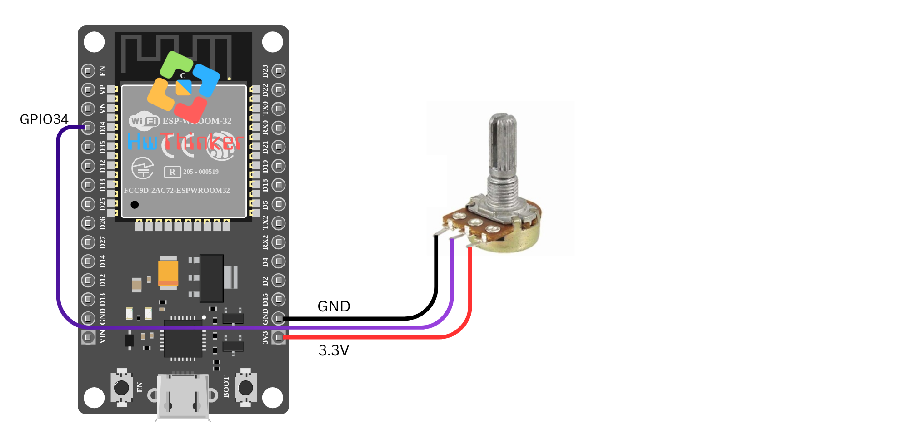

### **Tutorial Membaca Nilai Analog dengan ESP32 menggunakan GPIO34**

Pada tutorial kali ini, kita akan menggunakan ESP32 untuk membaca nilai analog dari pin **GPIO34** dan menampilkannya melalui monitor serial. Pin ini sering digunakan untuk input analog di ESP32 dan mendukung pembacaan sinyal dengan resolusi hingga 12 bit.

#### **Alat dan Bahan yang Dibutuhkan:**

- Board **ESP32** (misalnya ESP32 DevKit V1)
- Kabel USB untuk menghubungkan ESP32 ke komputer
- Perangkat dengan output analog (misalnya sensor potensiometer atau sensor suhu)

#### **Langkah-langkah:**

1. **Persiapan dan Koneksi:** Hubungkan perangkat input analog (seperti sensor potensiometer) ke **GPIO34** pada ESP32. Sesuaikan gambar koneksi yang telah Anda sediakan untuk memastikan semuanya terhubung dengan benar.



3. **Pengaturan Pin dan Resolusi Analog:** Pada kode ini, kita akan membaca nilai analog dari pin GPIO34. ESP32 mendukung resolusi pembacaan analog hingga 12 bit, yang berarti nilai yang dibaca akan berada dalam rentang 0 hingga 4095.

4. **Kode Program:**

   ```c++
   #include <Arduino.h>
   
   const int analogPin = 34;  // GPIO34
   
   void setup() {
       Serial.begin(115200);
       // Initialize the analog pin
       analogReadResolution(12); // Set the resolution to 12 bits (0-4095)
   }
   
   void loop() {
       int analogValue = analogRead(analogPin); // Baca nilai analog dari pin GPIO34
       Serial.print("Analog value: ");          // Tampilkan nilai analog pada serial monitor
       Serial.println(analogValue);
       delay(1000); // Delay 1 detik untuk pembacaan berikutnya
   }
   ```

5. **Penjelasan Kode:**

   - **`analogPin = 34`**: Menentukan pin GPIO34 sebagai pin input analog.
   - **`analogReadResolution(12)`**: Mengatur resolusi pembacaan analog menjadi 12 bit, yang memberikan nilai pembacaan antara 0 hingga 4095.
   - **`analogRead(analogPin)`**: Fungsi ini digunakan untuk membaca nilai analog dari pin GPIO34.
   - **`Serial.print()` dan `Serial.println()`**: Digunakan untuk menampilkan nilai yang dibaca ke **Serial Monitor**.
   - **`delay(1000)`**: Menambahkan jeda selama 1 detik sebelum pembacaan berikutnya dimulai.

6. **Upload dan Monitor Hasil:** Setelah Anda meng-upload kode ke ESP32, buka **Serial Monitor** di Arduino IDE. Anda akan melihat nilai analog yang dibaca dari GPIO34 muncul setiap detik. Nilai ini akan bervariasi tergantung pada perangkat input yang Anda sambungkan ke pin tersebut.

#### **Pemecahan Masalah:**

- Jika nilai yang terbaca tidak sesuai harapan, pastikan koneksi perangkat input analog Anda sudah benar dan stabil.
- Pastikan menggunakan kabel yang baik dan kuat untuk menghindari gangguan sinyal.

Dengan tutorial ini, Anda dapat mulai membaca sinyal analog menggunakan ESP32, yang berguna untuk berbagai aplikasi seperti sensor suhu, sensor cahaya, dan banyak lagi.