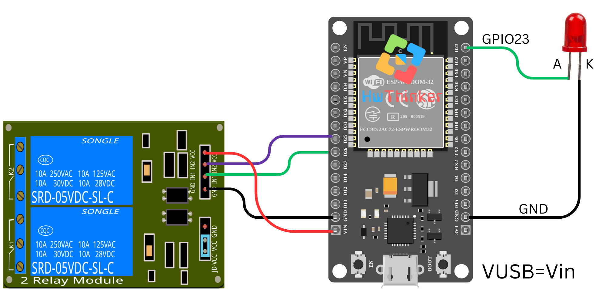

## 04: Tutorial Pengendalian Relay dan LED dengan ESP32

Pada tutorial ini, kita akan membuat program untuk mengendalikan dua relay dan sebuah LED menggunakan ESP32. Kode ini akan menyalakan dan mematikan relay dan LED secara bergantian dengan interval 1 detik.

### Alat dan Bahan yang Dibutuhkan:

- **ESP32** (misalnya ESP32 DevKit V1)
- 2 **Relay Modul** (misalnya 5V Relay)
- 1 **LED**
- Kabel jumper
- Breadboard (opsional)

### Langkah-langkah:

1. **Persiapan dan Koneksi:**

   - Hubungkan dua relay ke pin **GPIO25** dan **GPIO26** pada ESP32.
   - Hubungkan LED ke pin **GPIO23**.
   - Pastikan relay dan LED terhubung ke sumber daya yang sesuai. Pastikan juga relay dapat mengendalikan beban yang sesuai (misalnya lampu atau perangkat lain).

   

2. **Kode Program:**

   ```c++
   #include <Arduino.h>
   
   #define RLY1 25     // Pin untuk Relay 1
   #define RLY2 26     // Pin untuk Relay 2
   #define LED 23      // Pin untuk LED
   
   // Fungsi setup yang dijalankan sekali saat ESP32 direset atau dinyalakan
   void setup() {
     // Menetapkan pin sebagai output
     pinMode(RLY1, OUTPUT);
     pinMode(RLY2, OUTPUT);
     pinMode(LED, OUTPUT);
   }
   
   // Fungsi loop yang dijalankan terus-menerus
   void loop() {
     // Menyalakan Relay 1
     digitalWrite(RLY1, HIGH);  // Mengaktifkan Relay 1
     delay(1000);                // Tunggu selama 1 detik
     digitalWrite(RLY1, LOW);   // Mematikan Relay 1
     delay(1000);                // Tunggu selama 1 detik
   
     // Menyalakan Relay 2
     digitalWrite(RLY2, HIGH);  // Mengaktifkan Relay 2
     delay(1000);                // Tunggu selama 1 detik
     digitalWrite(RLY2, LOW);   // Mematikan Relay 2
     delay(1000);                // Tunggu selama 1 detik
   
     // Menyalakan LED
     digitalWrite(LED, HIGH);   // Menyalakan LED
     delay(1000);                // Tunggu selama 1 detik
     digitalWrite(LED, LOW);    // Mematikan LED
     delay(1000);                // Tunggu selama 1 detik
   }
   ```

3. **Penjelasan Kode:**

   - **`#define RLY1 25`, `RLY2 26`, `LED 23`**: Mendefinisikan pin-pin yang digunakan untuk mengendalikan dua relay (GPIO25 dan GPIO26) dan satu LED (GPIO23).
   - **`pinMode(RLY1, OUTPUT);`**: Mengatur pin yang terhubung dengan relay dan LED sebagai **output**.
   - **`digitalWrite(RLY1, HIGH);`**: Menyalakan relay dengan memberikan sinyal **HIGH** (tegangan).
   - **`digitalWrite(RLY1, LOW);`**: Mematikan relay dengan memberikan sinyal **LOW** (tanpa tegangan).
   - Fungsi **`delay(1000);`** menunda eksekusi selama 1000 milidetik (1 detik), memungkinkan relay dan LED menyala selama 1 detik sebelum dimatikan.

4. **Upload dan Monitor Hasil:** Setelah meng-upload kode ke ESP32, relay dan LED akan menyala dan mati secara bergantian setiap detik. Anda akan melihat Relay 1 dan Relay 2 serta LED menyala dan mati dalam urutan yang sudah ditentukan.

### Pemecahan Masalah:

- Jika relay tidak bekerja dengan benar, periksa koneksi kabel dan pastikan relay mendapatkan sumber daya yang cukup.
- Jika LED tidak menyala, pastikan koneksi ke pin **GPIO23** sudah benar dan LED terhubung dengan benar ke ground.

Dengan tutorial ini, Anda dapat mengendalikan perangkat berbasis relay menggunakan ESP32, yang sangat berguna dalam aplikasi otomasi rumah atau proyek lain yang membutuhkan pengendalian perangkat jarak jauh