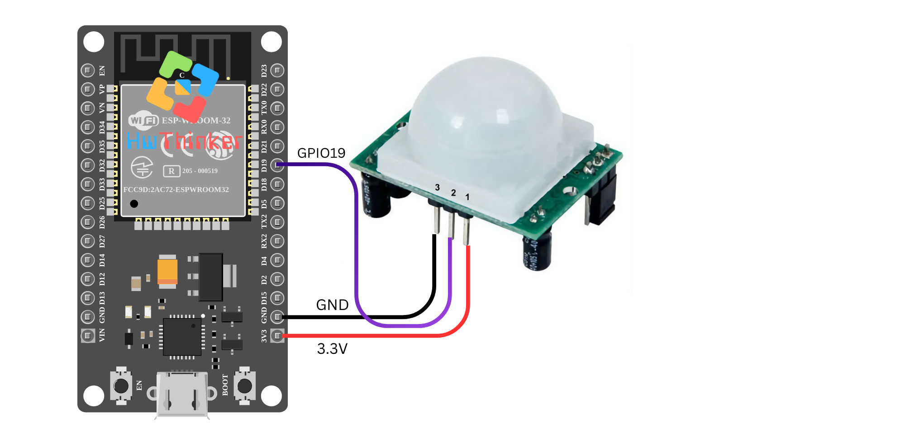

## 05:PIR Sensor dengan ESP32

Pada tutorial ini, kita akan menghubungkan **PIR Sensor** (Passive Infrared Sensor) ke **ESP32** untuk mendeteksi gerakan dan menampilkan hasilnya di Serial Monitor.

### Alat dan Bahan yang Dibutuhkan:

- **ESP32** (misalnya ESP32 DevKit V1)
- **PIR Sensor** (misalnya HC-SR501)
- Kabel jumper
- Breadboard (opsional)

### Langkah-langkah:

1. **Persiapan dan Koneksi:**

   - **VCC** dari PIR sensor dihubungkan ke **5V** pada ESP32.
   - **GND** dari PIR sensor dihubungkan ke **GND** pada ESP32.
   - **OUT** dari PIR sensor dihubungkan ke **GPIO19** pada ESP32.

   

2. **Kode Program:**

   ```c++
   #include <Arduino.h>
   
   const int pirPin = 19; // Pin where the PIR sensor is connected
   
   void setup() {
     Serial.begin(115200);
     pinMode(pirPin, INPUT);
   }
   
   void loop() {
     int pirState = digitalRead(pirPin);
     
     if (pirState == HIGH) {
       Serial.println("Object detected");
     }
     
     delay(1000); // Delay to avoid serial flooding
   }
   ```

3. ### Penjelasan Kode:

   - **`#include <Arduino.h>`**: Menyertakan library Arduino untuk mendukung penggunaan ESP32.
   - **`const int pirPin = 19;`**: Mendefinisikan pin GPIO19 sebagai tempat sensor PIR terhubung.
   - **`pinMode(pirPin, INPUT);`**: Menyiapkan pin GPIO19 sebagai input untuk membaca status sensor.
   - **`int pirState = digitalRead(pirPin);`**: Membaca status dari sensor PIR. Jika mendeteksi gerakan, nilai `pirState` akan menjadi HIGH.
   - **`if (pirState == HIGH)`**: Jika sensor PIR mendeteksi gerakan, akan mencetak pesan "Object detected" pada Serial Monitor.
   - **`delay(1000);`**: Menunggu selama 1 detik untuk mencegah flood data ke Serial Monitor.

4. **Upload dan Monitor Hasil:** Setelah meng-upload kode ke ESP32, buka **Serial Monitor** (dengan baud rate 115200) untuk melihat hasilnya. Jika PIR sensor mendeteksi gerakan, maka akan muncul pesan "Object detected" pada Serial Monitor setiap kali gerakan terdeteksi. Jika tidak ada gerakan, maka tidak ada pesan yang akan ditampilkan.

### Pemecahan Masalah:

- Pastikan koneksi sensor PIR ke ESP32 sudah benar (VCC ke 5V, GND ke GND, dan OUT ke GPIO19).
- Jika sensor tidak memberikan hasil yang diinginkan, coba periksa sensitivitas dan waktu delay pada sensor PIR (pada modul seperti HC-SR501, ada potensi pengaturan untuk menyesuaikan sensitivitas).
- Pastikan tidak ada objek yang menghalangi sensor PIR atau sensor dalam posisi yang salah.

Dengan tutorial ini, Anda dapat menggunakan PIR sensor untuk mendeteksi gerakan dalam berbagai aplikasi, seperti sistem keamanan atau pengendalian perangkat otomatis.