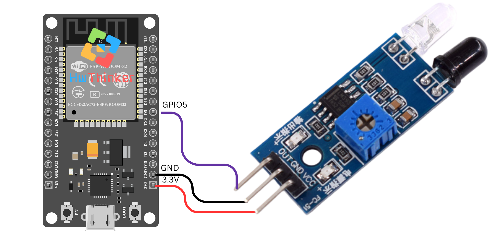

### 07: Penggunaan Sensor Garis dengan ESP32

Pada tutorial ini, kita akan membuat program untuk membaca status dari sensor garis menggunakan ESP32. Sensor garis digunakan untuk mendeteksi apakah suatu objek atau garis ada pada jalurnya, yang sering digunakan dalam robotika untuk mengikuti garis.

#### **Alat dan Bahan yang Dibutuhkan:**

- **ESP32** (misalnya ESP32 DevKit V1)
- **Sensor Garis** (misalnya sensor garis TCS3200 atau sensor analog sederhana)
- Kabel jumper
- Breadboard (opsional)

#### **Langkah-langkah:**

1. **Persiapan dan Koneksi:**

   - Hubungkan sensor garis ke **pin GPIO5** pada ESP32.
   - Pastikan sensor garis terhubung ke sumber daya yang sesuai. Sensor ini biasanya memiliki tiga pin: VCC, GND, dan output (yang akan dihubungkan ke pin GPIO pada ESP32).

   

2. **Kode Program:**

   ```c++
   #include <Arduino.h>
   
   const int lineSensorPin = 5; // Pin yang digunakan untuk sensor garis
   
   void setup() {
     // Inisialisasi Serial untuk komunikasi
     Serial.begin(115200);
     
     // Mengatur pin sensor garis sebagai input
     pinMode(lineSensorPin, INPUT);
   }
   
   void loop() {
     // Membaca status dari sensor garis
     int sensorValue = digitalRead(lineSensorPin);
   
     // Jika terdeteksi garis (asumsi low saat garis terdeteksi)
     if (sensorValue == LOW) {
       Serial.println("Garis terdeteksi!");
     } else {
       Serial.println("Tidak ada garis.");
     }
   
     // Tunggu sebentar sebelum membaca lagi
     delay(100);
   }
   ```

3. **Penjelasan Kode:**

   - **`const int lineSensorPin = 5;`**: Mendefinisikan pin GPIO5 untuk sensor garis.
   - **`pinMode(lineSensorPin, INPUT);`**: Mengatur pin GPIO5 sebagai input karena kita ingin membaca status dari sensor garis.
   - **`int sensorValue = digitalRead(lineSensorPin);`**: Membaca status sensor garis. Fungsi `digitalRead` akan mengembalikan nilai **LOW** atau **HIGH**, tergantung pada kondisi sensor.
   - **`if (sensorValue == LOW)`**: Jika nilai yang dibaca adalah **LOW**, berarti sensor mendeteksi garis. Dalam kebanyakan sensor garis, kondisi ini menunjukkan bahwa sensor berada di atas garis hitam (terdeteksi).
   - **`Serial.println("Garis terdeteksi!");`**: Mencetak pesan "Garis terdeteksi!" ke Serial Monitor jika sensor mendeteksi garis.
   - **`delay(100);`**: Menunggu selama 100 milidetik sebelum membaca status sensor lagi. Hal ini memberikan jeda waktu agar pembacaan sensor tidak terlalu sering dan lebih stabil.

4. **Upload dan Monitor Hasil:** Setelah meng-upload kode ke ESP32, buka Serial Monitor di Arduino IDE. Anda akan melihat pesan yang menunjukkan apakah garis terdeteksi atau tidak berdasarkan pembacaan sensor. Jika sensor berada di atas garis hitam, pesan "Garis terdeteksi!" akan muncul, jika tidak, akan muncul pesan "Tidak ada garis."

#### **Pemecahan Masalah:**

- Jika sensor tidak memberikan pembacaan yang akurat, pastikan sensor garis terpasang dengan benar dan berada dalam jarak yang tepat dari garis.
- Jika sensor membaca **HIGH** meskipun ada garis, pastikan sensor terhubung dengan benar dan cobalah menyesuaikan posisi atau jenis sensor yang digunakan.

Dengan tutorial ini, Anda dapat mulai menggunakan sensor garis dengan ESP32 untuk aplikasi robotika atau proyek lain yang memerlukan deteksi garis.