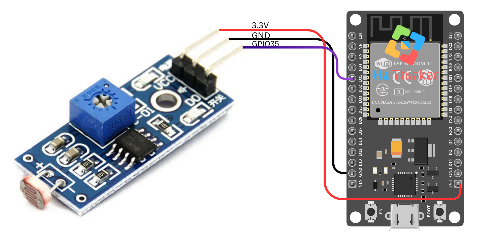

### **Tutorial Membaca Nilai Analog LDR dengan ESP32 pada GPIO35**

Pada tutorial ini, kita akan membaca nilai analog dari pin **GPIO35** pada ESP32 menggunakan fungsi **analogRead()**. Nilai tersebut akan dikirim ke **Serial Monitor** setiap detik.

#### **Alat dan Bahan yang Dibutuhkan:**

- **ESP32** (misalnya ESP32 DevKit V1)
- Kabel jumper
- Breadboard (opsional, tergantung pengaturan)

#### **Langkah-langkah:**

1. **Persiapan dan Koneksi:**

   - **GPIO35** adalah salah satu pin input analog pada ESP32. Anda dapat menghubungkan sumber sinyal analog ke pin ini, misalnya potensiometer atau sensor analog lainnya.
   - Tidak ada koneksi eksternal yang wajib selain dari pin **GPIO35** yang digunakan untuk membaca sinyal analog.

   

2. **Kode Program:**

   ```c++
   #include <Arduino.h>
   
   const int analogPin = 35;  // Pin GPIO35
   
   void setup() {
       Serial.begin(115200);  // Mulai komunikasi serial
       // Inisialisasi pin analog
       analogReadResolution(12);  // Set resolusi menjadi 12 bit (0-4095)
   }
   
   void loop() {
       int analogValue = analogRead(analogPin);  // Membaca nilai analog
       Serial.print("Nilai Analog: ");
       Serial.println(analogValue);  // Menampilkan nilai analog ke Serial Monitor
       delay(1000);  // Tunggu selama 1 detik
   }
   ```

3. **Penjelasan Kode:**

   - **`const int analogPin = 35;`**: Mendefinisikan pin **GPIO35** sebagai pin tempat kita akan membaca nilai analog.
   - **`analogReadResolution(12);`**: Mengatur resolusi pembacaan analog menjadi **12 bit**, sehingga nilai yang dibaca berkisar antara 0 hingga 4095. Resolusi ini meningkatkan presisi pembacaan sinyal analog.
   - **`analogRead(analogPin);`**: Fungsi ini membaca nilai analog dari pin yang telah ditentukan (dalam hal ini **GPIO35**). Nilai yang dibaca adalah antara 0 dan 4095, tergantung pada tegangan yang diterima oleh pin tersebut.
   - **`Serial.print()` dan `Serial.println()`**: Digunakan untuk menampilkan nilai yang dibaca pada **Serial Monitor**.
   - **`delay(1000);`**: Menambahkan jeda 1 detik di antara pembacaan untuk memberi waktu bagi Serial Monitor untuk menampilkan hasil.

4. **Upload dan Monitor Hasil:** Setelah meng-upload kode ke ESP32, buka **Serial Monitor** di Arduino IDE. Anda akan melihat nilai yang dibaca dari pin **GPIO35** akan muncul setiap 1 detik. Nilai ini bisa bervariasi tergantung pada sumber sinyal analog yang terhubung ke pin tersebut.

   Format hasil yang muncul di Serial Monitor akan terlihat seperti berikut:

   ```yaml
   Nilai Analog: 2048
   Nilai Analog: 1500
   Nilai Analog: 3800
   ```

#### **Pemecahan Masalah:**

- Jika nilai yang dibaca selalu **0** atau **4095**, periksa apakah ada sinyal analog yang benar-benar terhubung ke **GPIO35**.
- Jika tidak ada data yang muncul di **Serial Monitor**, pastikan Anda sudah menghubungkan ESP32 dengan benar ke komputer dan memilih port yang tepat di Arduino IDE.

Dengan tutorial ini, Anda dapat mulai membaca data analog menggunakan ESP32, yang bisa diaplikasikan dalam berbagai proyek seperti membaca sensor analog, potensiometer, atau sensor lain yang mengeluarkan sinyal analog.