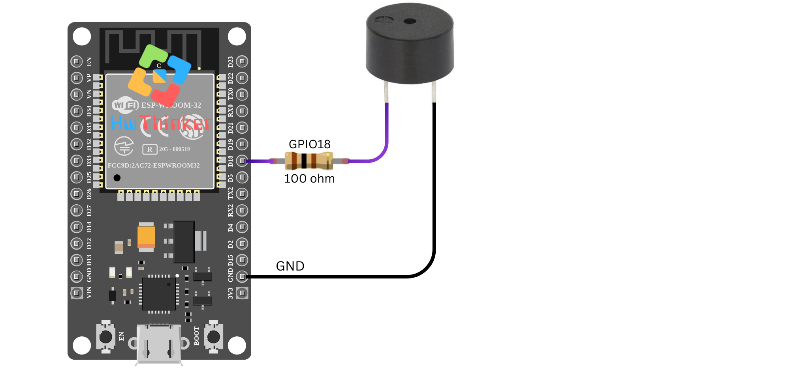

### **Tutorial Mengontrol Buzzer dengan ESP32 menggunakan GPIO18**

Pada tutorial ini, kita akan mengontrol buzzer dengan ESP32 menggunakan **GPIO18**. Buzzer akan diaktifkan dan dimatikan secara bergantian dengan interval satu detik menggunakan fungsi `digitalWrite()`.

#### **Alat dan Bahan yang Dibutuhkan:**

- Board **ESP32** (misalnya ESP32 DevKit V1)
- 1 buah **buzzer aktif** (Active Buzzer)
- 1 buah resistor 220Ω (untuk pembatas arus)
- Kabel jumper
- Breadboard

#### **Langkah-langkah:**

1. **Persiapan dan Koneksi:**

   - Sambungkan pin positif dari buzzer ke **GPIO18** pada ESP32.
   - Sambungkan pin negatif dari buzzer ke **ground (GND)** melalui resistor 100Ω (opsional, sebagai pembatas arus).

   **Catatan:** Jika buzzer Anda aktif, cukup sambungkan langsung ke pin GPIO tanpa resistor.



2. **Kode Program:**

   ```
   cppCopy code#include <Arduino.h>
   // Definisikan pin buzzer aktif
   #define LED_PIN1 18
   
   void setup() {
     // Atur pin sebagai output untuk buzzer
     pinMode(LED_PIN1, OUTPUT);
   }
   
   void loop() {
     // Nyalakan buzzer pada pin GPIO18
     digitalWrite(LED_PIN1, HIGH);
     delay(1000); // Tunggu selama 1 detik
   
     // Matikan buzzer pada pin GPIO18
     digitalWrite(LED_PIN1, LOW);
     delay(1000); // Tunggu selama 1 detik
   }
   ```

3. **Penjelasan Kode:**

   - **`#define LED_PIN1 18`**: Mendefinisikan **GPIO18** sebagai pin yang terhubung ke buzzer.
   - **`pinMode(LED_PIN1, OUTPUT)`**: Menetapkan pin GPIO18 sebagai **output**, yang memungkinkan kita untuk mengontrol buzzer.
   - **`digitalWrite(LED_PIN1, HIGH)`**: Mengaktifkan buzzer dengan mengirimkan sinyal **HIGH** (tegangan positif) ke GPIO18, sehingga buzzer berbunyi.
   - **`digitalWrite(LED_PIN1, LOW)`**: Mematikan buzzer dengan mengirimkan sinyal **LOW** (ground) ke GPIO18, sehingga buzzer berhenti berbunyi.
   - **`delay(1000)`**: Menambahkan jeda selama 1 detik antara kondisi aktif dan non-aktif buzzer.

4. **Upload dan Monitor Hasil:** Setelah Anda meng-upload kode ke ESP32, buzzer yang terhubung ke GPIO18 akan berbunyi selama 1 detik, kemudian berhenti selama 1 detik, dan siklus ini akan terus berulang.

#### **Pemecahan Masalah:**

- Jika buzzer tidak berbunyi, pastikan koneksi sudah benar dan buzzer Anda dalam keadaan aktif (buzzer aktif hanya memerlukan tegangan untuk beroperasi).
- Jika buzzer tidak berhenti berbunyi, periksa kembali apakah kode telah ter-upload dengan benar dan pastikan pin GPIO yang digunakan sesuai dengan yang terhubung.

Dengan tutorial ini, Anda dapat mulai mengontrol buzzer menggunakan ESP32, yang sangat berguna untuk aplikasi pemberitahuan suara atau alarm.

------