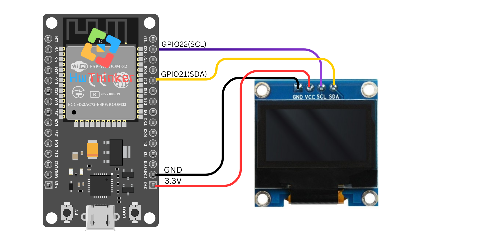

### 11: Menggunakan OLED 0.96 I2C dengan ESP32

Pada tutorial ini, kita akan menghubungkan layar OLED 0.96" I2C ke board ESP32 dan menampilkan teks "Hello, world!" pada layar OLED menggunakan library **Adafruit_SSD1306**.

#### **Alat dan Bahan yang Dibutuhkan:**

- **ESP32** (misalnya ESP32 DevKit V1)
- **OLED 0.96 I2C Display**
- Kabel jumper
- Breadboard (opsional)

#### **Langkah-langkah:**

1. **Persiapan dan Koneksi:**

   - **VCC** dari OLED dihubungkan ke **3V** pada ESP32.
   - **GND** dari OLED dihubungkan ke **GND** pada ESP32.
   - **SDA** dari OLED dihubungkan ke **GPIO21** (default SDA pada ESP32).
   - **SCL** dari OLED dihubungkan ke **GPIO22** (default SCL pada ESP32).

   

2. **Kode Program:**

   ```c++
   #include <Wire.h>
   #include <Adafruit_GFX.h>
   #include <Adafruit_SSD1306.h>
   
   #define SCREEN_WIDTH 128  // OLED display width, in pixels
   #define SCREEN_HEIGHT 64  // OLED display height, in pixels
   
   // Declaration for an SSD1306 display connected to I2C (SDA, SCL pins)
   #define OLED_RESET     -1  // Reset pin # (or -1 if sharing Arduino reset pin)
   Adafruit_SSD1306 display(SCREEN_WIDTH, SCREEN_HEIGHT, &Wire, OLED_RESET);
   
   void setup() {
     // Initialize serial communication at 115200 baud
     Serial.begin(115200);
   
     // Initialize I2C communication
     Wire.begin();
   
     // Initialize OLED display with I2C address 0x3C
     if(!display.begin(SSD1306_SWITCHCAPVCC, 0x3C)) {
       Serial.println(F("SSD1306 allocation failed"));
       for(;;);
     }
   
     // Clear the buffer
     display.clearDisplay();
   
     // Display text
     display.setTextSize(1);      // Normal 1:1 pixel scale
     display.setTextColor(SSD1306_WHITE); // Draw white text
     display.setCursor(0, 0);     // Start at top-left corner
     display.println(F("Hello, world!"));
     display.display();
   }
   
   void loop() {
     // Nothing to do here
   }
   ```

3. **Penjelasan Kode:**

   - **`#include <Wire.h>`**: Library untuk komunikasi I2C.
   - **`#include <Adafruit_GFX.h>`**: Library grafis untuk OLED.
   - **`#include <Adafruit_SSD1306.h>`**: Library spesifik untuk mengendalikan layar OLED SSD1306.
   - **`Adafruit_SSD1306 display(SCREEN_WIDTH, SCREEN_HEIGHT, &Wire, OLED_RESET);`**: Membuat objek display untuk mengontrol layar OLED.
   - **`display.begin(SSD1306_SWITCHCAPVCC, 0x3C);`**: Inisialisasi layar OLED dengan alamat I2C **0x3C**.
   - **`display.clearDisplay();`**: Membersihkan buffer layar sebelum menampilkan konten baru.
   - **`display.setTextSize(1);`**: Menentukan ukuran teks (1 berarti ukuran normal).
   - **`display.setTextColor(SSD1306_WHITE);`**: Menentukan warna teks (putih).
   - **`display.setCursor(0, 0);`**: Menentukan posisi kursor di sudut kiri atas layar.
   - **`display.println(F("Hello, world!"));`**: Menampilkan teks "Hello, world!" pada layar OLED.
   - **`display.display();`**: Mengupdate tampilan pada layar OLED dengan teks yang telah ditentukan.

4. **Upload dan Monitor Hasil:** Setelah meng-upload kode ke ESP32, Anda akan melihat pesan "Hello, world!" muncul pada layar OLED. Jika layar tidak menampilkan teks, pastikan sambungan kabel I2C sudah benar dan alamat I2C (0x3C) sudah sesuai dengan yang digunakan oleh modul OLED Anda.

#### **Pemecahan Masalah:**

- Jika tampilan kosong atau error muncul, pastikan alamat I2C yang digunakan sesuai. Anda bisa memeriksa alamat I2C dengan scanner I2C.
- Periksa sambungan SDA dan SCL ke pin yang benar pada ESP32 (GPIO21 untuk SDA dan GPIO22 untuk SCL).

Dengan tutorial ini, Anda dapat memulai menggunakan layar OLED 0.96" I2C dengan ESP32 untuk menampilkan informasi atau membuat tampilan antarmuka sederhana pada proyek Anda.