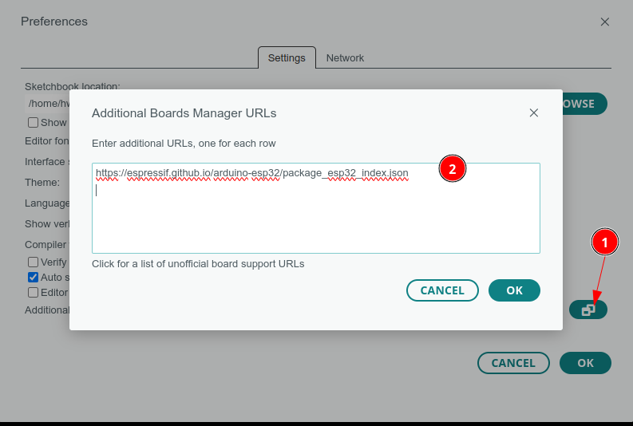
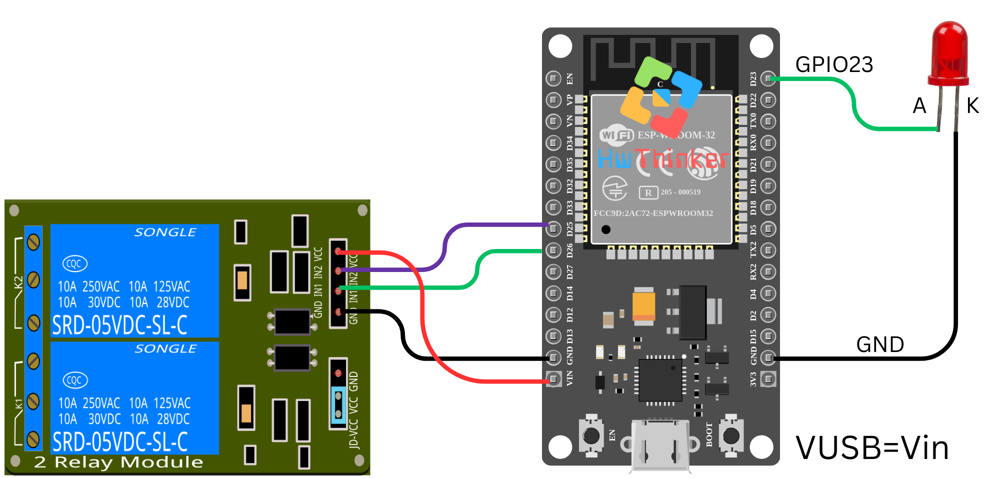
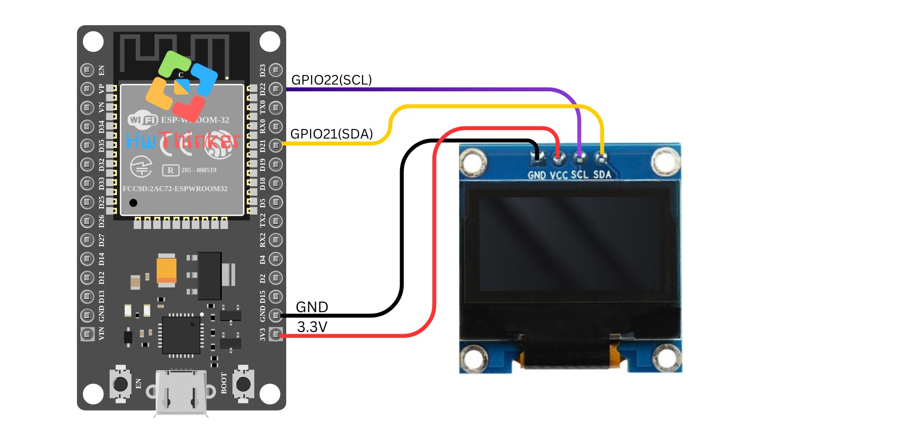

# Modul ESP32 Basic Startkit IOT 


## Modul ESP32 doit esp32


## Note ESP32

- Pada ESP32, ADC2 digunakan oleh modul Wi-Fi untuk keperluan internal, yang dapat memengaruhi pembacaan dari beberapa channel ADC2. Secara khusus, channel ADC2 yang digunakan oleh Wi-Fi adalah:
  - ADC2_CHANNEL_0 (GPIO4)
  - ADC2_CHANNEL_2 (GPIO2)
  - ADC2_CHANNEL_4 (GPIO13)
  - ADC2_CHANNEL_5 (GPIO12)
  - ADC2_CHANNEL_6 (GPIO14)

- Pada ESP32 DOIT Devkit V1, beberapa pin tidak bisa digunakan sebagai GPIO output karena memiliki fungsi khusus atau dibatasi oleh desain perangkat keras. Selain VCC dan GND, pin-pinnya yang tidak dapat digunakan sebagai GPIO output meliputi:

  - GPIO1 (TX0) dan GPIO3 (RX0): Digunakan sebagai pin TX dan RX untuk komunikasi serial (UART0). Mengubah fungsi GPIO mereka dapat mengganggu komunikasi serial, terutama saat boot.
  - GPIO6 hingga GPIO11: Digunakan sebagai pin untuk jalur bus SPI flash. Mereka terhubung ke memori flash dan tidak dapat digunakan sebagai GPIO output.
  - GPIO16 dan GPIO17: Biasanya digunakan untuk fungsionalitas yang terkait dengan Wi-Fi dan Bluetooth serta digunakan untuk komunikasi internal dan pemrograman. Mereka juga tidak selalu dapat digunakan sebagai GPIO output.
  - GPIO34, GPIO35, GPIO36, dan GPIO39: Biasanya digunakan sebagai input ADC. Walaupun beberapa dari pin ini bisa diprogram sebagai GPIO input, mereka seringkali tidak dapat digunakan sebagai GPIO output atau memiliki batasan dalam penggunaannya.

## Tutorial  Basic ESP32 DOIT DevKit V1 30 Pin dengan Arduino IDE

### Outline

1. [Persiapan Perangkat Keras](https://www.notion.so/Modul-ESP32-Basic-Startkit-IOT-14ec8692d12f80318c2bd9a8837f0697?pvs=21)
2. [Instalasi Driver dan Arduino IDE](https://www.notion.so/Modul-ESP32-Basic-Startkit-IOT-14ec8692d12f80318c2bd9a8837f0697?pvs=21)
3. [Konfigurasi ESP32 di Arduino IDE](https://www.notion.so/Modul-ESP32-Basic-Startkit-IOT-14ec8692d12f80318c2bd9a8837f0697?pvs=21)
4. [Skema Koneksi](https://www.notion.so/Modul-ESP32-Basic-Startkit-IOT-14ec8692d12f80318c2bd9a8837f0697?pvs=21)
5. [Project Blinky](https://www.notion.so/Modul-ESP32-Basic-Startkit-IOT-14ec8692d12f80318c2bd9a8837f0697?pvs=21)
6. [Panduan Upload Kode](https://www.notion.so/Modul-ESP32-Basic-Startkit-IOT-14ec8692d12f80318c2bd9a8837f0697?pvs=21)
7. [Troubleshooting](https://www.notion.so/Modul-ESP32-Basic-Startkit-IOT-14ec8692d12f80318c2bd9a8837f0697?pvs=21)

### Persiapan Perangkat Keras

Komponen yang Dibutuhkan

- ESP32 DOIT DevKit V1 30 Pin
- Kabel USB Tipe-C atau Micro USB
- Komputer/Laptop
- (Opsional) LED dan Resistor 220Ω untuk project Blinky

### Spesifikasi ESP32 DOIT DevKit V1 30 Pin

- Mikroprosesor: Dual-core Xtensa LX6
- Frekuensi Clock: Up to 240 MHz
- SRAM: 520 KB
- Flash: 4 MB
- Fitur Tambahan:
  - WiFi
  - Bluetooth Classic
  - Bluetooth Low Energy (BLE)
  - 30 Pin GPIO
  - Analog-to-Digital Converter (ADC)
  - Digital-to-Analog Converter (DAC)
  - Touch Sensors

### Instalasi Driver dan Arduino IDE

#### Langkah 1: Unduh Arduino IDE

1. Kunjungi situs resmi Arduino: https://www.arduino.cc/en/software
2. Pilih versi sesuai sistem operasi Anda (Windows/macOS/Linux)
3. Unduh dan instal Arduino IDE

#### Langkah 2: Instalasi Driver USB

##### Windows

1. Hubungkan ESP32 ke komputer
2. Buka Device Manager
3. Cari port yang belum dikenali
4. Unduh driver CH340/CP2102 dari situs resmi produsen

##### macOS

- Biasanya tidak memerlukan driver tambahan
- Gunakan kabel USB bawaan

##### Linux

- Mayoritas distribusi Linux sudah mendukung secara langsung
- Jalankan perintah `sudo usermod -a -G dialout $USER` untuk izin akses port

### Konfigurasi ESP32 di Arduino IDE

#### Langkah 1: Tambahkan Repositori ESP32

1. Buka Arduino IDE

2. Pergi ke File > Preferences


3. Klik Additional Board Manager

 

4. Di kolom "Additional Board Manager URLs", tambahkan:

   ```
   <https://espressif.github.io/arduino-esp32/package_esp32_index.json>
   ```



#### Langkah 2: Instal Board ESP32

1. Buka Board Manager
   - Tools > Board > Board Manager

2. Cari "esp32"

3. Pilih "ESP32 by Espressif Systems"


4. Klik "Install"

#### Langkah 3: Pilih Board

1. Tools > Board > ESP32 Arduino
2. Pilih "DOIT ESP32 DEVKIT V1"


### Skema Koneksi

#### Koneksi LED untuk Blinky

- Gunakan GPIO2 (built-in LED pada beberapa board) atau Atau gunakan GPIO 16 untuk external LED

```
GPIO 16 ---- Resistor 220Ω ---- LED ---- GND
```

### Project Blinky

```cpp
#define LED_PIN 16//  atau GPIO 2 untuk Built-in LED

void setup() {
  pinMode(LED_PIN, OUTPUT);// Set pin LED sebagai output
}

void loop() {
  digitalWrite(LED_PIN, HIGH);// Nyalakan LED
  delay(1000);// Tunggu 1 detik
  digitalWrite(LED_PIN, LOW);// Matikan LED
  delay(1000);// Tunggu 1 detik
}
```

### Panduan Upload Kode

Tombol Upload pada ESP32

ESP32 memiliki dua tombol penting untuk proses upload:

1. Tombol EN (Enable/Reset)
   - Berfungsi untuk me-reset modul
   - Tekan untuk me-restart ESP32
2. Tombol BOOT (GPIO 0)
   - Digunakan untuk mode bootloader
   - Ditekan saat upload kode

### Prosedur Upload Kode

1. Hubungkan ESP32 ke komputer
2. Pilih port COM yang benar
   - Tools > Port > Pilih port ESP32
3. Proses Upload:
   - Tekan dan tahan tombol BOOT
   - Sambil masih menekan BOOT, tekan tombol EN sebentar
   - Lepaskan tombol BOOT
4. Klik tombol Upload di Arduino IDE
5. Pastikan tekan Tombol EN agar program baru dijalankan
> [!NOTE] 
> Bila  muncul tulisan status koneksi terus sepert dibawah ini kemungkinan penekanan tombol kurang sempurna. 
>
> ----esptool.py v3.0-dev
> ----Serial port COM…
> ----Connecting........_____....._____.....__
>
> Jika demkian ulangi penekanan tombol pada proses upload smap muncul info
>
> ----Compressed 261792 bytes to 122378...
> ----Writing at 0x00010000... (12 %)
> ----Writing at 0x00014000... (25 %)
> ----Writing at 0x00018000... (37 %)

> [!NOTE] 
> INGAT YA WAJIB Di Klik Tombol RESET/EN   setelah proses upload selesai, tanpa itu program yang baru diupload tidak akan dijalankan
> Bila masih kesulitan silahkan cek video tutorial ESP32 Doit Devkit V1 menggunakan software arduino  yang dapat anda lihat di https://youtu.be/Vqr1Fi2xECs

> [!WARNING]
> ESP32 Doit Devkit V1 ada beberapa varian chip serial  yaitu varian dengan chip serial ch9102 ,CP2102 atau CH340. pastikan anda menginstall driver serial USB yang benar. 
> Download driver lewat google dengan kata kunci download driver ch9102/CP2102/ch340

### Project Lainnya

- [01-helloworld](../src/01-helloworld) 
- [02-blinky](../src/02-blinky) 
- [03-analog](src/03-analog) 
- [04-relay](src/04-relay) 
- [05-PIR](src/05-PIR) 
- [06-dht11](src/06-dht11) 
- [07-linesensor](src/07-linesensor) 
- [08-LDR](src/08-LDR) 
- [09-passive_buzzer](src/09-passive_buzzer) 
- [10-active_buzzer](src/10-active_buzzer) 
- [11-OLED](src/11-OLED) 
- [12-MQTT-pub](src/12-MQTT-pub) 
- [13-MQTT-pub-sub](src/13-MQTT-pub-sub) 
- [14-MQTT-pub-sub-feedback](src/14-MQTT-pub-sub-feedback) 
- 

### Troubleshooting Upload

- **Masalah Umum:**
  - Gagal upload
  - Port tidak terdeteksi
  - Kegagalan koneksi
- **Solusi:**
  1. Periksa kabel USB
  2. Ganti kabel/port
  3. Instal ulang driver
  4. Pastikan urutan menekan tombol benar
  5. Restart Arduino IDE

**Kode Tidak Terupload**

- Pastikan tombol BOOT ditekan dengan benar
- Periksa driver USB
- Coba kabel USB lain
- Restart komputer

**LED Tidak Berkedip**

- Periksa koneksi hardware
- Pastikan pin benar
- Periksa resistor
- Cek polaritas LED

**Koneksi Port Bermasalah**

- Periksa Device Manager
- Update/Reinstall driver
- Coba port USB lain

**Tips Tambahan**

- Selalu gunakan kabel data USB, bukan kabel charging
- Simpan dokumentasi pin ESP32 untuk referensi
- Gunakan external power bank jika diperlukan
- Backup project secara berkala

### Referensi Lanjutan

- Dokumentasi Resmi ESP32: https://docs.espressif.com/

- Arduino ESP32 GitHub: https://github.com/espressif/arduino-esp32

  

## 01: Menampilkan "Hello, World!" pada Serial Monitor dengan Arduino

Pada tutorial ini, kita akan membuat program sederhana di Arduino yang menampilkan pesan **"Hello, World!"** di **Serial Monitor**. Ini adalah langkah pertama yang umum dilakukan saat belajar pemrograman mikrokontroler menggunakan Arduino.

**Prasyarat:**

1. **Arduino Board**: Anda bisa menggunakan board seperti Arduino Uno atau board berbasis ATmega328P lainnya.
2. **Arduino IDE**: Anda perlu menginstal Arduino IDE untuk menulis dan mengunggah kode ke board Arduino.
3. **Serial Monitor**: Digunakan untuk memantau output dari board Arduino melalui koneksi USB.

**Langkah-langkah:**

1. **Setup Serial Communication**
   - Program dimulai dengan `Serial.begin(115200);` untuk memulai komunikasi serial dengan kecepatan 115200 baud. Angka 115200 adalah kecepatan baud standar yang digunakan di banyak board Arduino.
2. **Menunggu Koneksi Serial (Opsional untuk Debugging)**
   - `while (!Serial) {;}` adalah bagian opsional yang berguna untuk memastikan bahwa komunikasi serial telah terhubung sepenuhnya sebelum melanjutkan eksekusi program. Ini digunakan terutama pada board seperti **Arduino Leonardo** dan **Arduino Micro**, yang memerlukan waktu untuk menyambung ke komputer.
3. **Menampilkan Pesan "Hello, World!"**
   - `Serial.println("Hello, World!");` digunakan untuk menampilkan pesan **"Hello, World!"** pada **Serial Monitor**. Fungsi `println` digunakan agar teks yang dicetak diikuti dengan baris baru (enter).
4. **Looping Tanpa Aksi**
   - Fungsi `loop()` dibiarkan kosong karena program hanya mencetak pesan sekali pada saat **setup()**. Jika Anda ingin menambahkan lebih banyak perintah yang dijalankan berulang kali, Anda bisa menambahkannya ke dalam fungsi **loop()**.

**Kode Program:**

```c++
#include <Arduino.h>

void setup() {
    // Memulai komunikasi serial dengan kecepatan 115200 baud
    Serial.begin(115200);
    
    // Menunggu koneksi serial (untuk keperluan debugging)
    while (!Serial) {
        ;
    }
    
    // Mencetak pesan "Hello, World!" ke Serial Monitor
    Serial.println("Hello, World!");
}

void loop() {
    // Tidak ada aksi yang dilakukan di sini
}
```

**Langkah-langkah Penggunaan:**

1. **Unggah Program ke Arduino:**
   - Pilih board Arduino yang sesuai di Arduino IDE dan pastikan port serial yang benar telah dipilih.
   - Klik tombol **Upload** untuk mengunggah program ke board Arduino.
2. **Lihat Output di Serial Monitor:**
   - Buka **Serial Monitor** di Arduino IDE (klik ikon kaca pembesar di pojok kanan atas).
   - Anda akan melihat pesan **"Hello, World!"** ditampilkan pada Serial Monitor.

**Kesimpulan:** Tutorial ini memberikan gambaran tentang bagaimana menampilkan output sederhana ke Serial Monitor dengan menggunakan board Arduino. Program ini dapat dikembangkan lebih lanjut untuk membaca input dari pengguna atau sensor, serta memberikan umpan balik dalam bentuk teks melalui serial.

## 02: Blinky LED dengan ESP32

Pada tutorial ini, kita akan membuat program **blinky LED** sederhana menggunakan ESP32. LED akan menyala dan mati secara bergantian setiap detik, yang merupakan aplikasi dasar untuk memulai penggunaan pin GPIO pada ESP32.

### Alat dan Bahan yang Dibutuhkan:

- **ESP32** (misalnya ESP32 DevKit V1)
- **LED**
- **Resistor 220Ω**
- Kabel jumper
- Breadboard (opsional)

### Langkah-langkah:

1. **Persiapan dan Koneksi:**

   - Hubungkan LED ke **pin GPIO23** pada ESP32.
   - Gunakan resistor 220Ω untuk membatasi arus dan melindungi LED agar tidak rusak.
   - Pastikan LED terhubung ke ground (GND) melalui resistor.

   

2. **Kode Program:**

   ```c++
   #include <Arduino.h>
   
   // Definisikan pin LED
   #define LED_PIN1 23
   
   void setup() {
     // Atur pin LED sebagai output
     pinMode(LED_PIN1, OUTPUT);
   }
   
   void loop() {
     // Nyalakan LED
     digitalWrite(LED_PIN1, HIGH);  // Menyalakan LED (HIGH adalah tegangan positif)
     delay(1000);                    // Tunggu selama 1 detik
   
     // Matikan LED
     digitalWrite(LED_PIN1, LOW);   // Mematikan LED (LOW adalah tanpa tegangan)
     delay(1000);                    // Tunggu selama 1 detik
   }
   ```

3. **Penjelasan Kode:**

   - **`#define LED_PIN1 23`**: Mendefinisikan pin GPIO23 untuk LED. Anda bisa mengganti nomor pin ini sesuai dengan pin yang Anda gunakan.
   - **`pinMode(LED_PIN1, OUTPUT);`**: Mengatur pin GPIO23 sebagai output, karena kita akan mengendalikan LED melalui pin ini.
   - **`digitalWrite(LED_PIN1, HIGH);`**: Menyalakan LED dengan memberi sinyal tegangan tinggi (HIGH) pada pin GPIO23.
   - **`digitalWrite(LED_PIN1, LOW);`**: Mematikan LED dengan memberi sinyal tegangan rendah (LOW) pada pin GPIO23.
   - **`delay(1000);`**: Fungsi ini akan menghentikan eksekusi program selama 1000 milidetik (1 detik), yang menyebabkan LED menyala atau mati selama 1 detik sebelum beralih.

4. **Upload dan Monitor Hasil:** Setelah meng-upload kode ke ESP32, LED yang terhubung dengan GPIO23 akan mulai berkedip, menyala selama 1 detik dan mati selama 1 detik. Ini adalah contoh sederhana untuk mengendalikan LED menggunakan ESP32.

### Pemecahan Masalah:

- Jika LED tidak menyala, periksa apakah kabel terhubung dengan benar dan pastikan LED serta resistor dipasang dengan benar.
- Jika LED berkedip terlalu cepat atau terlalu lambat, Anda bisa menyesuaikan nilai delay (misalnya, ubah `delay(1000);` menjadi nilai yang lebih besar atau lebih kecil).

Dengan tutorial ini, Anda dapat memulai eksperimen dengan kontrol dasar GPIO pada ESP32 dan mengembangkan aplikasi yang lebih kompleks di masa depan.

## 03 Membaca Nilai Analog dengan ESP32 menggunakan GPIO34

Pada tutorial kali ini, kita akan menggunakan ESP32 untuk membaca nilai analog dari pin **GPIO34** dan menampilkannya melalui monitor serial. Pin ini sering digunakan untuk input analog di ESP32 dan mendukung pembacaan sinyal dengan resolusi hingga 12 bit.

### Alat dan Bahan yang Dibutuhkan:

- Board **ESP32** (misalnya ESP32 DevKit V1)
- Kabel USB untuk menghubungkan ESP32 ke komputer
- Perangkat dengan output analog (misalnya sensor potensiometer atau sensor suhu)

### Langkah-langkah:

1. **Persiapan dan Koneksi:** Hubungkan perangkat input analog (seperti sensor potensiometer) ke **GPIO34** pada ESP32. Sesuaikan gambar koneksi yang telah Anda sediakan untuk memastikan semuanya terhubung dengan benar.


3. **Pengaturan Pin dan Resolusi Analog:** Pada kode ini, kita akan membaca nilai analog dari pin GPIO34. ESP32 mendukung resolusi pembacaan analog hingga 12 bit, yang berarti nilai yang dibaca akan berada dalam rentang 0 hingga 4095.

4. **Kode Program:**

   ```c++
   #include <Arduino.h>
   
   const int analogPin = 34;  // GPIO34
   
   void setup() {
       Serial.begin(115200);
       // Initialize the analog pin
       analogReadResolution(12); // Set the resolution to 12 bits (0-4095)
   }
   
   void loop() {
       int analogValue = analogRead(analogPin); // Baca nilai analog dari pin GPIO34
       Serial.print("Analog value: ");          // Tampilkan nilai analog pada serial monitor
       Serial.println(analogValue);
       delay(1000); // Delay 1 detik untuk pembacaan berikutnya
   }
   ```

5. **Penjelasan Kode:**

   - **`analogPin = 34`**: Menentukan pin GPIO34 sebagai pin input analog.
   - **`analogReadResolution(12)`**: Mengatur resolusi pembacaan analog menjadi 12 bit, yang memberikan nilai pembacaan antara 0 hingga 4095.
   - **`analogRead(analogPin)`**: Fungsi ini digunakan untuk membaca nilai analog dari pin GPIO34.
   - **`Serial.print()` dan `Serial.println()`**: Digunakan untuk menampilkan nilai yang dibaca ke **Serial Monitor**.
   - **`delay(1000)`**: Menambahkan jeda selama 1 detik sebelum pembacaan berikutnya dimulai.

6. **Upload dan Monitor Hasil:** Setelah Anda meng-upload kode ke ESP32, buka **Serial Monitor** di Arduino IDE. Anda akan melihat nilai analog yang dibaca dari GPIO34 muncul setiap detik. Nilai ini akan bervariasi tergantung pada perangkat input yang Anda sambungkan ke pin tersebut.

### Pemecahan Masalah:

- Jika nilai yang terbaca tidak sesuai harapan, pastikan koneksi perangkat input analog Anda sudah benar dan stabil.
- Pastikan menggunakan kabel yang baik dan kuat untuk menghindari gangguan sinyal.

Dengan tutorial ini, Anda dapat mulai membaca sinyal analog menggunakan ESP32, yang berguna untuk berbagai aplikasi seperti sensor suhu, sensor cahaya, dan banyak lagi.


## 04: Tutorial Pengendalian Relay dan LED dengan ESP32

Pada tutorial ini, kita akan membuat program untuk mengendalikan dua relay dan sebuah LED menggunakan ESP32. Kode ini akan menyalakan dan mematikan relay dan LED secara bergantian dengan interval 1 detik.

### Alat dan Bahan yang Dibutuhkan:

- **ESP32** (misalnya ESP32 DevKit V1)
- 2 **Relay Modul** (misalnya 5V Relay)
- 1 **LED**
- Kabel jumper
- Breadboard (opsional)

### Langkah-langkah:

1. **Persiapan dan Koneksi:**

   - Hubungkan dua relay ke pin **GPIO25** dan **GPIO26** pada ESP32.
   - Hubungkan LED ke pin **GPIO23**.
   - Pastikan relay dan LED terhubung ke sumber daya yang sesuai. Pastikan juga relay dapat mengendalikan beban yang sesuai (misalnya lampu atau perangkat lain).

   

2. **Kode Program:**

   ```c++
   #include <Arduino.h>
   
   #define RLY1 25     // Pin untuk Relay 1
   #define RLY2 26     // Pin untuk Relay 2
   #define LED 23      // Pin untuk LED
   
   // Fungsi setup yang dijalankan sekali saat ESP32 direset atau dinyalakan
   void setup() {
     // Menetapkan pin sebagai output
     pinMode(RLY1, OUTPUT);
     pinMode(RLY2, OUTPUT);
     pinMode(LED, OUTPUT);
   }
   
   // Fungsi loop yang dijalankan terus-menerus
   void loop() {
     // Menyalakan Relay 1
     digitalWrite(RLY1, HIGH);  // Mengaktifkan Relay 1
     delay(1000);                // Tunggu selama 1 detik
     digitalWrite(RLY1, LOW);   // Mematikan Relay 1
     delay(1000);                // Tunggu selama 1 detik
   
     // Menyalakan Relay 2
     digitalWrite(RLY2, HIGH);  // Mengaktifkan Relay 2
     delay(1000);                // Tunggu selama 1 detik
     digitalWrite(RLY2, LOW);   // Mematikan Relay 2
     delay(1000);                // Tunggu selama 1 detik
   
     // Menyalakan LED
     digitalWrite(LED, HIGH);   // Menyalakan LED
     delay(1000);                // Tunggu selama 1 detik
     digitalWrite(LED, LOW);    // Mematikan LED
     delay(1000);                // Tunggu selama 1 detik
   }
   ```

3. **Penjelasan Kode:**

   - **`#define RLY1 25`, `RLY2 26`, `LED 23`**: Mendefinisikan pin-pin yang digunakan untuk mengendalikan dua relay (GPIO25 dan GPIO26) dan satu LED (GPIO23).
   - **`pinMode(RLY1, OUTPUT);`**: Mengatur pin yang terhubung dengan relay dan LED sebagai **output**.
   - **`digitalWrite(RLY1, HIGH);`**: Menyalakan relay dengan memberikan sinyal **HIGH** (tegangan).
   - **`digitalWrite(RLY1, LOW);`**: Mematikan relay dengan memberikan sinyal **LOW** (tanpa tegangan).
   - Fungsi **`delay(1000);`** menunda eksekusi selama 1000 milidetik (1 detik), memungkinkan relay dan LED menyala selama 1 detik sebelum dimatikan.

4. **Upload dan Monitor Hasil:** Setelah meng-upload kode ke ESP32, relay dan LED akan menyala dan mati secara bergantian setiap detik. Anda akan melihat Relay 1 dan Relay 2 serta LED menyala dan mati dalam urutan yang sudah ditentukan.

### Pemecahan Masalah:

- Jika relay tidak bekerja dengan benar, periksa koneksi kabel dan pastikan relay mendapatkan sumber daya yang cukup.
- Jika LED tidak menyala, pastikan koneksi ke pin **GPIO23** sudah benar dan LED terhubung dengan benar ke ground.

Dengan tutorial ini, Anda dapat mengendalikan perangkat berbasis relay menggunakan ESP32, yang sangat berguna dalam aplikasi otomasi rumah atau proyek lain yang membutuhkan pengendalian perangkat jarak jauh

## 05:PIR Sensor dengan ESP32

Pada tutorial ini, kita akan menghubungkan **PIR Sensor** (Passive Infrared Sensor) ke **ESP32** untuk mendeteksi gerakan dan menampilkan hasilnya di Serial Monitor.

### Alat dan Bahan yang Dibutuhkan:

- **ESP32** (misalnya ESP32 DevKit V1)
- **PIR Sensor** (misalnya HC-SR501)
- Kabel jumper
- Breadboard (opsional)

### Langkah-langkah:

1. **Persiapan dan Koneksi:**

   - **VCC** dari PIR sensor dihubungkan ke **5V** pada ESP32.
   - **GND** dari PIR sensor dihubungkan ke **GND** pada ESP32.
   - **OUT** dari PIR sensor dihubungkan ke **GPIO19** pada ESP32.

   

2. **Kode Program:**

   ```c++
   #include <Arduino.h>
   
   const int pirPin = 19; // Pin where the PIR sensor is connected
   
   void setup() {
     Serial.begin(115200);
     pinMode(pirPin, INPUT);
   }
   
   void loop() {
     int pirState = digitalRead(pirPin);
     
     if (pirState == HIGH) {
       Serial.println("Object detected");
     }
     
     delay(1000); // Delay to avoid serial flooding
   }
   ```

3. ### Penjelasan Kode:

   - **`#include <Arduino.h>`**: Menyertakan library Arduino untuk mendukung penggunaan ESP32.
   - **`const int pirPin = 19;`**: Mendefinisikan pin GPIO19 sebagai tempat sensor PIR terhubung.
   - **`pinMode(pirPin, INPUT);`**: Menyiapkan pin GPIO19 sebagai input untuk membaca status sensor.
   - **`int pirState = digitalRead(pirPin);`**: Membaca status dari sensor PIR. Jika mendeteksi gerakan, nilai `pirState` akan menjadi HIGH.
   - **`if (pirState == HIGH)`**: Jika sensor PIR mendeteksi gerakan, akan mencetak pesan "Object detected" pada Serial Monitor.
   - **`delay(1000);`**: Menunggu selama 1 detik untuk mencegah flood data ke Serial Monitor.

4. **Upload dan Monitor Hasil:** Setelah meng-upload kode ke ESP32, buka **Serial Monitor** (dengan baud rate 115200) untuk melihat hasilnya. Jika PIR sensor mendeteksi gerakan, maka akan muncul pesan "Object detected" pada Serial Monitor setiap kali gerakan terdeteksi. Jika tidak ada gerakan, maka tidak ada pesan yang akan ditampilkan.

### Pemecahan Masalah:

- Pastikan koneksi sensor PIR ke ESP32 sudah benar (VCC ke 5V, GND ke GND, dan OUT ke GPIO19).
- Jika sensor tidak memberikan hasil yang diinginkan, coba periksa sensitivitas dan waktu delay pada sensor PIR (pada modul seperti HC-SR501, ada potensi pengaturan untuk menyesuaikan sensitivitas).
- Pastikan tidak ada objek yang menghalangi sensor PIR atau sensor dalam posisi yang salah.

Dengan tutorial ini, Anda dapat menggunakan PIR sensor untuk mendeteksi gerakan dalam berbagai aplikasi, seperti sistem keamanan atau pengendalian perangkat otomatis.

## 06: Tutorial Membaca Suhu dan Kelembapan dengan DHT11 menggunakan ESP32

Pada tutorial kali ini, kita akan menggunakan **sensor DHT11** untuk membaca data suhu dan kelembapan. Data tersebut akan dibaca oleh ESP32 dan ditampilkan melalui **Serial Monitor**.

### Alat dan Bahan yang Dibutuhkan:

- **ESP32** (misalnya ESP32 DevKit V1)
- **Sensor DHT11**
- Kabel jumper
- Breadboard

### Langkah-langkah:

1. **Persiapan dan Koneksi:**

   - Sambungkan pin **VCC** pada sensor DHT11 ke pin **3.3V** pada ESP32.
   - Sambungkan pin **GND** pada sensor DHT11 ke **GND** pada ESP32.
   - Sambungkan pin **DATA** pada sensor DHT11 ke **GPIO4** pada ESP32 (pin ini akan kita gunakan untuk membaca data dari sensor).

   **Catatan:** Pastikan sambungan sudah benar, dan periksa kembali apakah sensor DHT11 yang Anda gunakan memiliki pinout yang sesuai dengan yang dijelaskan.

   

2. **Kode Program:**

   ```c++
   #include <Arduino.h>
   #include <DHT.h>
   
   #define DHTPIN 4     // Pin tempat DHT11 terhubung
   #define DHTTYPE DHT11   // Jenis sensor DHT (DHT11)
   
   DHT dht(DHTPIN, DHTTYPE);
   
   void setup() {
     Serial.begin(115200);  // Inisialisasi komunikasi serial
     dht.begin();           // Inisialisasi sensor DHT11
   }
   
   void loop() {
     delay(2000);  // Tunggu beberapa detik antar pengukuran
   
     float humidity = dht.readHumidity();  // Membaca kelembapan
     float temperature = dht.readTemperature();  // Membaca suhu dalam celcius
   
     // Cek jika pembacaan gagal
     if (isnan(humidity) || isnan(temperature)) {
       Serial.println("Gagal membaca dari sensor DHT!");
       return;
     }
   
     // Menampilkan hasil pembacaan suhu dan kelembapan
     Serial.print("Kelembapan: ");
     Serial.print(humidity);
     Serial.print(" %\t");
     Serial.print("Suhu: ");
     Serial.print(temperature);
     Serial.println(" *C");
   }
   ```

3. **Penjelasan Kode:**

   - **`#define DHTPIN 4`**: Menetapkan pin GPIO4 pada ESP32 sebagai tempat sensor DHT11 terhubung.
   - **`#define DHTTYPE DHT11`**: Menentukan jenis sensor yang digunakan adalah **DHT11**.
   - **`DHT dht(DHTPIN, DHTTYPE)`**: Membuat objek **dht** untuk berkomunikasi dengan sensor DHT11.
   - **`dht.begin()`**: Inisialisasi sensor DHT11 pada pin yang sudah ditentukan.
   - **`dht.readHumidity()`**: Membaca nilai kelembapan dari sensor DHT11.
   - **`dht.readTemperature()`**: Membaca nilai suhu dalam derajat Celcius.
   - **`isnan(humidity) || isnan(temperature)`**: Memeriksa apakah pembacaan sensor gagal. Jika gagal, akan mencetak pesan kesalahan.
   - **`Serial.print()` dan `Serial.println()`**: Digunakan untuk menampilkan nilai kelembapan dan suhu ke **Serial Monitor**.

4. **Upload dan Monitor Hasil:** Setelah Anda meng-upload kode ke ESP32, buka **Serial Monitor** di Arduino IDE. Anda akan melihat nilai kelembapan dan suhu yang terbaca dari sensor DHT11 muncul setiap 2 detik (interval `delay(2000)`), yang menampilkan data dalam format berikut:

   ```yaml
   Kelembapan: 60.00 %    Suhu: 25.00 *C
   ```

### Pemecahan Masalah:

- Jika tidak ada data yang muncul atau nilai yang terbaca salah (misalnya NaN), pastikan kabel sudah terhubung dengan benar, terutama kabel **DATA** pada pin yang tepat.
- Jika pesan "Gagal membaca dari sensor DHT!" muncul, pastikan sensor dalam kondisi baik dan terhubung dengan benar.

Dengan tutorial ini, Anda dapat mulai menggunakan sensor DHT11 untuk mengukur suhu dan kelembapan dengan ESP32, yang bisa diaplikasikan pada berbagai proyek IoT seperti monitoring cuaca, rumah pintar, atau aplikasi otomatisasi.

## 07: Penggunaan Sensor Garis dengan ESP32

Pada tutorial ini, kita akan membuat program untuk membaca status dari sensor garis menggunakan ESP32. Sensor garis digunakan untuk mendeteksi apakah suatu objek atau garis ada pada jalurnya, yang sering digunakan dalam robotika untuk mengikuti garis.

### Alat dan Bahan yang Dibutuhkan:

- **ESP32** (misalnya ESP32 DevKit V1)
- **Sensor Garis** (misalnya sensor garis TCS3200 atau sensor analog sederhana)
- Kabel jumper
- Breadboard (opsional)

### Langkah-langkah:

1. **Persiapan dan Koneksi:**

   - Hubungkan sensor garis ke **pin GPIO5** pada ESP32.
   - Pastikan sensor garis terhubung ke sumber daya yang sesuai. Sensor ini biasanya memiliki tiga pin: VCC, GND, dan output (yang akan dihubungkan ke pin GPIO pada ESP32).

   

2. **Kode Program:**

   ```c++
   #include <Arduino.h>
   
   const int lineSensorPin = 5; // Pin yang digunakan untuk sensor garis
   
   void setup() {
     // Inisialisasi Serial untuk komunikasi
     Serial.begin(115200);
     
     // Mengatur pin sensor garis sebagai input
     pinMode(lineSensorPin, INPUT);
   }
   
   void loop() {
     // Membaca status dari sensor garis
     int sensorValue = digitalRead(lineSensorPin);
   
     // Jika terdeteksi garis (asumsi low saat garis terdeteksi)
     if (sensorValue == LOW) {
       Serial.println("Garis terdeteksi!");
     } else {
       Serial.println("Tidak ada garis.");
     }
   
     // Tunggu sebentar sebelum membaca lagi
     delay(100);
   }
   ```

3. **Penjelasan Kode:**

   - **`const int lineSensorPin = 5;`**: Mendefinisikan pin GPIO5 untuk sensor garis.
   - **`pinMode(lineSensorPin, INPUT);`**: Mengatur pin GPIO5 sebagai input karena kita ingin membaca status dari sensor garis.
   - **`int sensorValue = digitalRead(lineSensorPin);`**: Membaca status sensor garis. Fungsi `digitalRead` akan mengembalikan nilai **LOW** atau **HIGH**, tergantung pada kondisi sensor.
   - **`if (sensorValue == LOW)`**: Jika nilai yang dibaca adalah **LOW**, berarti sensor mendeteksi garis. Dalam kebanyakan sensor garis, kondisi ini menunjukkan bahwa sensor berada di atas garis hitam (terdeteksi).
   - **`Serial.println("Garis terdeteksi!");`**: Mencetak pesan "Garis terdeteksi!" ke Serial Monitor jika sensor mendeteksi garis.
   - **`delay(100);`**: Menunggu selama 100 milidetik sebelum membaca status sensor lagi. Hal ini memberikan jeda waktu agar pembacaan sensor tidak terlalu sering dan lebih stabil.

4. **Upload dan Monitor Hasil:** Setelah meng-upload kode ke ESP32, buka Serial Monitor di Arduino IDE. Anda akan melihat pesan yang menunjukkan apakah garis terdeteksi atau tidak berdasarkan pembacaan sensor. Jika sensor berada di atas garis hitam, pesan "Garis terdeteksi!" akan muncul, jika tidak, akan muncul pesan "Tidak ada garis."

### Pemecahan Masalah:

- Jika sensor tidak memberikan pembacaan yang akurat, pastikan sensor garis terpasang dengan benar dan berada dalam jarak yang tepat dari garis.
- Jika sensor membaca **HIGH** meskipun ada garis, pastikan sensor terhubung dengan benar dan cobalah menyesuaikan posisi atau jenis sensor yang digunakan.

Dengan tutorial ini, Anda dapat mulai menggunakan sensor garis dengan ESP32 untuk aplikasi robotika atau proyek lain yang memerlukan deteksi garis.


## 08:Membaca Nilai Analog LDR dengan ESP32 pada GPIO35

Pada tutorial ini, kita akan membaca nilai analog dari pin **GPIO35** pada ESP32 menggunakan fungsi **analogRead()**. Nilai tersebut akan dikirim ke **Serial Monitor** setiap detik.

### Alat dan Bahan yang Dibutuhkan:

- **ESP32** (misalnya ESP32 DevKit V1)
- Kabel jumper
- Breadboard (opsional, tergantung pengaturan)

### Langkah-langkah:

1. **Persiapan dan Koneksi:**

   - **GPIO35** adalah salah satu pin input analog pada ESP32. Anda dapat menghubungkan sumber sinyal analog ke pin ini, misalnya potensiometer atau sensor analog lainnya.
   - Tidak ada koneksi eksternal yang wajib selain dari pin **GPIO35** yang digunakan untuk membaca sinyal analog.

   

2. **Kode Program:**

   ```c++
   #include <Arduino.h>
   
   const int analogPin = 35;  // Pin GPIO35
   
   void setup() {
       Serial.begin(115200);  // Mulai komunikasi serial
       // Inisialisasi pin analog
       analogReadResolution(12);  // Set resolusi menjadi 12 bit (0-4095)
   }
   
   void loop() {
       int analogValue = analogRead(analogPin);  // Membaca nilai analog
       Serial.print("Nilai Analog: ");
       Serial.println(analogValue);  // Menampilkan nilai analog ke Serial Monitor
       delay(1000);  // Tunggu selama 1 detik
   }
   ```

3. **Penjelasan Kode:**

   - **`const int analogPin = 35;`**: Mendefinisikan pin **GPIO35** sebagai pin tempat kita akan membaca nilai analog.
   - **`analogReadResolution(12);`**: Mengatur resolusi pembacaan analog menjadi **12 bit**, sehingga nilai yang dibaca berkisar antara 0 hingga 4095. Resolusi ini meningkatkan presisi pembacaan sinyal analog.
   - **`analogRead(analogPin);`**: Fungsi ini membaca nilai analog dari pin yang telah ditentukan (dalam hal ini **GPIO35**). Nilai yang dibaca adalah antara 0 dan 4095, tergantung pada tegangan yang diterima oleh pin tersebut.
   - **`Serial.print()` dan `Serial.println()`**: Digunakan untuk menampilkan nilai yang dibaca pada **Serial Monitor**.
   - **`delay(1000);`**: Menambahkan jeda 1 detik di antara pembacaan untuk memberi waktu bagi Serial Monitor untuk menampilkan hasil.

4. **Upload dan Monitor Hasil:** Setelah meng-upload kode ke ESP32, buka **Serial Monitor** di Arduino IDE. Anda akan melihat nilai yang dibaca dari pin **GPIO35** akan muncul setiap 1 detik. Nilai ini bisa bervariasi tergantung pada sumber sinyal analog yang terhubung ke pin tersebut.

   Format hasil yang muncul di Serial Monitor akan terlihat seperti berikut:

   ```yaml
   Nilai Analog: 2048
   Nilai Analog: 1500
   Nilai Analog: 3800
   ```

### Pemecahan Masalah:

- Jika nilai yang dibaca selalu **0** atau **4095**, periksa apakah ada sinyal analog yang benar-benar terhubung ke **GPIO35**.
- Jika tidak ada data yang muncul di **Serial Monitor**, pastikan Anda sudah menghubungkan ESP32 dengan benar ke komputer dan memilih port yang tepat di Arduino IDE.

Dengan tutorial ini, Anda dapat mulai membaca data analog menggunakan ESP32, yang bisa diaplikasikan dalam berbagai proyek seperti membaca sensor analog, potensiometer, atau sensor lain yang mengeluarkan sinyal analog.

## 09: Mengontrol Buzzer dengan ESP32 menggunakan GPIO18

Pada tutorial ini, kita akan mengontrol buzzer dengan ESP32 menggunakan **GPIO18**. Buzzer akan diaktifkan dan dimatikan secara bergantian dengan interval satu detik menggunakan fungsi `digitalWrite()`.

### Alat dan Bahan yang Dibutuhkan:

- Board **ESP32** (misalnya ESP32 DevKit V1)
- 1 buah **buzzer aktif** (Active Buzzer)
- 1 buah resistor 220Ω (untuk pembatas arus)
- Kabel jumper
- Breadboard

### Langkah-langkah:

1. **Persiapan dan Koneksi:**

   - Sambungkan pin positif dari buzzer ke **GPIO18** pada ESP32.
   - Sambungkan pin negatif dari buzzer ke **ground (GND)** melalui resistor 100Ω (opsional, sebagai pembatas arus).

   **Catatan:** Jika buzzer Anda aktif, cukup sambungkan langsung ke pin GPIO tanpa resistor.


2. **Kode Program:**

   ```c++
   #include <Arduino.h>
   // Definisikan pin buzzer aktif
   #define LED_PIN1 18
   
   void setup() {
     // Atur pin sebagai output untuk buzzer
     pinMode(LED_PIN1, OUTPUT);
   }
   
   void loop() {
     // Nyalakan buzzer pada pin GPIO18
     digitalWrite(LED_PIN1, HIGH);
     delay(1000); // Tunggu selama 1 detik
   
     // Matikan buzzer pada pin GPIO18
     digitalWrite(LED_PIN1, LOW);
     delay(1000); // Tunggu selama 1 detik
   }
   ```

3. **Penjelasan Kode:**

   - **`#define LED_PIN1 18`**: Mendefinisikan **GPIO18** sebagai pin yang terhubung ke buzzer.
   - **`pinMode(LED_PIN1, OUTPUT)`**: Menetapkan pin GPIO18 sebagai **output**, yang memungkinkan kita untuk mengontrol buzzer.
   - **`digitalWrite(LED_PIN1, HIGH)`**: Mengaktifkan buzzer dengan mengirimkan sinyal **HIGH** (tegangan positif) ke GPIO18, sehingga buzzer berbunyi.
   - **`digitalWrite(LED_PIN1, LOW)`**: Mematikan buzzer dengan mengirimkan sinyal **LOW** (ground) ke GPIO18, sehingga buzzer berhenti berbunyi.
   - **`delay(1000)`**: Menambahkan jeda selama 1 detik antara kondisi aktif dan non-aktif buzzer.

4. **Upload dan Monitor Hasil:** Setelah Anda meng-upload kode ke ESP32, buzzer yang terhubung ke GPIO18 akan berbunyi selama 1 detik, kemudian berhenti selama 1 detik, dan siklus ini akan terus berulang.

### Pemecahan Masalah:

- Jika buzzer tidak berbunyi, pastikan koneksi sudah benar dan buzzer Anda dalam keadaan aktif (buzzer aktif hanya memerlukan tegangan untuk beroperasi).
- Jika buzzer tidak berhenti berbunyi, periksa kembali apakah kode telah ter-upload dengan benar dan pastikan pin GPIO yang digunakan sesuai dengan yang terhubung.

Dengan tutorial ini, Anda dapat mulai mengontrol buzzer menggunakan ESP32, yang sangat berguna untuk aplikasi pemberitahuan suara atau alarm.

------


## 10: Mengontrol Buzzer dengan ESP32 menggunakan GPIO18

Pada tutorial ini, kita akan mengontrol buzzer dengan ESP32 menggunakan **GPIO18**. Buzzer akan diaktifkan dan dimatikan secara bergantian dengan interval satu detik menggunakan fungsi `digitalWrite()`.

### Alat dan Bahan yang Dibutuhkan:

- Board **ESP32** (misalnya ESP32 DevKit V1)
- 1 buah **buzzer aktif** (Active Buzzer)
- 1 buah resistor 220Ω (untuk pembatas arus)
- Kabel jumper
- Breadboard

### Langkah-langkah:

1. **Persiapan dan Koneksi:**

   - Sambungkan pin positif dari buzzer ke **GPIO18** pada ESP32.
   - Sambungkan pin negatif dari buzzer ke **ground (GND)** melalui resistor 100Ω (opsional, sebagai pembatas arus).

   **Catatan:** Jika buzzer Anda aktif, cukup sambungkan langsung ke pin GPIO tanpa resistor.


2. **Kode Program:**

   ```c++
   #include <Arduino.h>
   // Definisikan pin buzzer aktif
   #define LED_PIN1 18
   
   void setup() {
     // Atur pin sebagai output untuk buzzer
     pinMode(LED_PIN1, OUTPUT);
   }
   
   void loop() {
     // Nyalakan buzzer pada pin GPIO18
     digitalWrite(LED_PIN1, HIGH);
     delay(1000); // Tunggu selama 1 detik
   
     // Matikan buzzer pada pin GPIO18
     digitalWrite(LED_PIN1, LOW);
     delay(1000); // Tunggu selama 1 detik
   }
   ```

3. **Penjelasan Kode:**

   - **`#define LED_PIN1 18`**: Mendefinisikan **GPIO18** sebagai pin yang terhubung ke buzzer.
   - **`pinMode(LED_PIN1, OUTPUT)`**: Menetapkan pin GPIO18 sebagai **output**, yang memungkinkan kita untuk mengontrol buzzer.
   - **`digitalWrite(LED_PIN1, HIGH)`**: Mengaktifkan buzzer dengan mengirimkan sinyal **HIGH** (tegangan positif) ke GPIO18, sehingga buzzer berbunyi.
   - **`digitalWrite(LED_PIN1, LOW)`**: Mematikan buzzer dengan mengirimkan sinyal **LOW** (ground) ke GPIO18, sehingga buzzer berhenti berbunyi.
   - **`delay(1000)`**: Menambahkan jeda selama 1 detik antara kondisi aktif dan non-aktif buzzer.

4. **Upload dan Monitor Hasil:** Setelah Anda meng-upload kode ke ESP32, buzzer yang terhubung ke GPIO18 akan berbunyi selama 1 detik, kemudian berhenti selama 1 detik, dan siklus ini akan terus berulang.

### Pemecahan Masalah:

- Jika buzzer tidak berbunyi, pastikan koneksi sudah benar dan buzzer Anda dalam keadaan aktif (buzzer aktif hanya memerlukan tegangan untuk beroperasi).
- Jika buzzer tidak berhenti berbunyi, periksa kembali apakah kode telah ter-upload dengan benar dan pastikan pin GPIO yang digunakan sesuai dengan yang terhubung.

Dengan tutorial ini, Anda dapat mulai mengontrol buzzer menggunakan ESP32, yang sangat berguna untuk aplikasi pemberitahuan suara atau alarm.

------


## 11: Menggunakan OLED 0.96 I2C dengan ESP32

Pada tutorial ini, kita akan menghubungkan layar OLED 0.96" I2C ke board ESP32 dan menampilkan teks "Hello, world!" pada layar OLED menggunakan library **Adafruit_SSD1306**.

### Alat dan Bahan yang Dibutuhkan:

- **ESP32** (misalnya ESP32 DevKit V1)
- **OLED 0.96 I2C Display**
- Kabel jumper
- Breadboard (opsional)

### Langkah-langkah:

1. **Persiapan dan Koneksi:**

   - **VCC** dari OLED dihubungkan ke **3V** pada ESP32.
   - **GND** dari OLED dihubungkan ke **GND** pada ESP32.
   - **SDA** dari OLED dihubungkan ke **GPIO21** (default SDA pada ESP32).
   - **SCL** dari OLED dihubungkan ke **GPIO22** (default SCL pada ESP32).

   

2. **Kode Program:**

   ```c++
   #include <Wire.h>
   #include <Adafruit_GFX.h>
   #include <Adafruit_SSD1306.h>
   
   #define SCREEN_WIDTH 128  // OLED display width, in pixels
   #define SCREEN_HEIGHT 64  // OLED display height, in pixels
   
   // Declaration for an SSD1306 display connected to I2C (SDA, SCL pins)
   #define OLED_RESET     -1  // Reset pin # (or -1 if sharing Arduino reset pin)
   Adafruit_SSD1306 display(SCREEN_WIDTH, SCREEN_HEIGHT, &Wire, OLED_RESET);
   
   void setup() {
     // Initialize serial communication at 115200 baud
     Serial.begin(115200);
   
     // Initialize I2C communication
     Wire.begin();
   
     // Initialize OLED display with I2C address 0x3C
     if(!display.begin(SSD1306_SWITCHCAPVCC, 0x3C)) {
       Serial.println(F("SSD1306 allocation failed"));
       for(;;);
     }
   
     // Clear the buffer
     display.clearDisplay();
   
     // Display text
     display.setTextSize(1);      // Normal 1:1 pixel scale
     display.setTextColor(SSD1306_WHITE); // Draw white text
     display.setCursor(0, 0);     // Start at top-left corner
     display.println(F("Hello, world!"));
     display.display();
   }
   
   void loop() {
     // Nothing to do here
   }
   ```

3. **Penjelasan Kode:**

   - **`#include <Wire.h>`**: Library untuk komunikasi I2C.
   - **`#include <Adafruit_GFX.h>`**: Library grafis untuk OLED.
   - **`#include <Adafruit_SSD1306.h>`**: Library spesifik untuk mengendalikan layar OLED SSD1306.
   - **`Adafruit_SSD1306 display(SCREEN_WIDTH, SCREEN_HEIGHT, &Wire, OLED_RESET);`**: Membuat objek display untuk mengontrol layar OLED.
   - **`display.begin(SSD1306_SWITCHCAPVCC, 0x3C);`**: Inisialisasi layar OLED dengan alamat I2C **0x3C**.
   - **`display.clearDisplay();`**: Membersihkan buffer layar sebelum menampilkan konten baru.
   - **`display.setTextSize(1);`**: Menentukan ukuran teks (1 berarti ukuran normal).
   - **`display.setTextColor(SSD1306_WHITE);`**: Menentukan warna teks (putih).
   - **`display.setCursor(0, 0);`**: Menentukan posisi kursor di sudut kiri atas layar.
   - **`display.println(F("Hello, world!"));`**: Menampilkan teks "Hello, world!" pada layar OLED.
   - **`display.display();`**: Mengupdate tampilan pada layar OLED dengan teks yang telah ditentukan.

4. **Upload dan Monitor Hasil:** Setelah meng-upload kode ke ESP32, Anda akan melihat pesan "Hello, world!" muncul pada layar OLED. Jika layar tidak menampilkan teks, pastikan sambungan kabel I2C sudah benar dan alamat I2C (0x3C) sudah sesuai dengan yang digunakan oleh modul OLED Anda.

### Pemecahan Masalah:

- Jika tampilan kosong atau error muncul, pastikan alamat I2C yang digunakan sesuai. Anda bisa memeriksa alamat I2C dengan scanner I2C.
- Periksa sambungan SDA dan SCL ke pin yang benar pada ESP32 (GPIO21 untuk SDA dan GPIO22 untuk SCL).

Dengan tutorial ini, Anda dapat memulai menggunakan layar OLED 0.96" I2C dengan ESP32 untuk menampilkan informasi atau membuat tampilan antarmuka sederhana pada proyek Anda.


## 12: Menggunakan MQTT dengan ESP32 untuk Mengirim Data Suhu dan Kelembaban (simulasi)

Pada tutorial ini, kita akan menggunakan **ESP32** untuk mengirim data suhu dan kelembaban ke **MQTT Broker** menggunakan protokol MQTT. Kami akan menghubungkan ESP32 ke WiFi dan MQTT broker dan mempublikasikan data suhu dan kelembaban dummy.

### Alat dan Bahan yang Dibutuhkan:

- **ESP32** (misalnya ESP32 DevKit V1)
- Koneksi internet (untuk WiFi dan MQTT broker)
- **MQTT Broker** seperti `broker.mqtt-dashboard.com` (untuk testing)
- **Mosquitto Client** (untuk subscribe data di broker MQTT, optional)

### Langkah-langkah:

1. **Persiapan dan Koneksi:**

   - Sambungkan **ESP32** ke komputer menggunakan kabel USB.
   - Pastikan **WiFi** diaktifkan dan terhubung dengan jaringan WiFi yang sesuai.

2. **Kode Program:** Berikut adalah kode untuk menghubungkan ESP32 ke WiFi dan MQTT Broker, serta mengirimkan data suhu dan kelembaban secara berkala.

   ```c++
   #include <WiFi.h>
   #include <ArduinoMqttClient.h>
   
   // Pengaturan WiFi
   const char* ssid = "Wokwi-GUEST";
   const char* password = "";
   
   // Pengaturan MQTT Broker
   const char* broker = "broker.mqtt-dashboard.com";
   int port = 1883;
   const char* temperatureTopic = "MQTT@ESP32BasicStartKitIOT/suhu";
   const char* humidityTopic = "MQTT@ESP32BasicStartKitIOT/kelembapan";
   
   // Inisialisasi WiFi dan MQTT Client
   WiFiClient wifiClient;
   MqttClient mqttClient(wifiClient);
   
   // Deklarasi fungsi
   void connectToWiFi();
   void connectToMqttBroker();
   void publishTemperature(float temperature);
   void publishHumidity(float humidity);
   
   void setup() {
     Serial.begin(115200);
   
     // Koneksi ke WiFi
     connectToWiFi();
   
     // Koneksi ke MQTT Broker
     connectToMqttBroker();
   }
   
   void loop() {
     if (!mqttClient.connected()) {
       connectToMqttBroker();
     }
   
     // Publikasi data suhu dan kelembaban dummies
     float dummyTemperature = 25.0 + random(0, 100) / 10.0; // Suhu dummies antara 25.0 hingga 34.9
     float dummyHumidity = 50.0 + random(0, 100) / 10.0;    // Kelembaban dummies antara 50.0 hingga 59.9
   
     publishTemperature(dummyTemperature);
     publishHumidity(dummyHumidity);
   
     // Delay sebelum mengirim data berikutnya
     delay(5000); // Mengirim data setiap 5 detik
   }
   
   void connectToWiFi() {
     Serial.print("Connecting to WiFi");
     WiFi.begin(ssid, password);
   
     while (WiFi.status() != WL_CONNECTED) {
       Serial.print(".");
       delay(1000);
     }
   
     Serial.println(" connected.");
   }
   
   void connectToMqttBroker() {
     Serial.print("Connecting to MQTT broker");
     while (!mqttClient.connect(broker, port)) {
       Serial.print(".");
       delay(1000);
     }
   
     Serial.println(" connected.");
   }
   
   void publishTemperature(float temperature) {
     if (mqttClient.beginMessage(temperatureTopic)) {
       mqttClient.print(temperature);
       mqttClient.endMessage();
       Serial.print("Published temperature: ");
       Serial.println(temperature);
     } else {
       Serial.println("Failed to publish temperature");
     }
   }
   
   void publishHumidity(float humidity) {
     if (mqttClient.beginMessage(humidityTopic)) {
       mqttClient.print(humidity);
       mqttClient.endMessage();
       Serial.print("Published humidity: ");
       Serial.println(humidity);
     } else {
       Serial.println("Failed to publish humidity");
     }
   }
   ```

3. **Penjelasan Kode:**

   - WiFi dan MQTT Setup:
     - `ssid` dan `password` digunakan untuk menghubungkan ESP32 ke jaringan WiFi.
     - `broker` berisi alamat MQTT broker yang digunakan untuk mengirim dan menerima pesan.
     - `MqttClient` digunakan untuk berkomunikasi dengan broker MQTT.
   - Fungsi `connectToWiFi`:
     - Fungsi ini menghubungkan ESP32 ke jaringan WiFi yang ditentukan dalam variabel `ssid` dan `password`.
   - Fungsi `connectToMqttBroker`:
     - Fungsi ini menghubungkan ESP32 ke broker MQTT menggunakan alamat broker dan port yang sudah ditentukan.
   - Fungsi `publishTemperature` dan `publishHumidity`:
     - Fungsi ini mengirimkan data suhu dan kelembaban secara berkala ke topik MQTT yang sudah ditentukan (`suhu` dan `kelembapan`).
     - Data suhu dan kelembaban dibuat secara acak menggunakan fungsi `random` untuk simulasi.

4. **Testing dengan Mosquitto Client:** Anda dapat menggunakan **mosquitto-client** untuk **subscribe** ke topik MQTT dan memonitor data yang dipublikasikan oleh ESP32. Jalankan perintah berikut pada terminal:

   - Untuk suhu:

     ```bash
     mosquitto_sub -h broker.mqtt-dashboard.com -t MQTT@ESP32BasicStartKitIOT/suhu
     ```

   - Untuk kelembaban:

     ```bash
     mosquitto_sub -h broker.mqtt-dashboard.com -t MQTT@ESP32BasicStartKitIOT/kelembapan
     ```

5. **Upload dan Monitor Hasil:**

   - Setelah meng-upload kode ke ESP32, buka **Serial Monitor** (dengan baud rate 115200).
   - Anda akan melihat data suhu dan kelembaban yang dipublikasikan secara berkala ke broker MQTT.

### Pemecahan Masalah:

- Jika ESP32 tidak dapat terhubung ke WiFi atau MQTT Broker, periksa kembali konfigurasi jaringan dan pastikan ESP32 terhubung dengan benar.
- Jika tidak ada data yang muncul di **Serial Monitor** atau **mosquitto-client**, periksa apakah topik dan alamat broker sudah benar.

Dengan tutorial ini, Anda dapat menghubungkan ESP32 dengan broker MQTT dan mengirimkan data suhu dan kelembaban secara real-time.

## 13: Menggunakan MQTT dengan ESP32 MQTT publisher dan subscriber dengan node-red

### MQTT Publisher (ESP32)

Publisher ini mengirimkan data suhu dan kelembapan secara periodik ke broker MQTT. Selain itu, publisher ini juga mendengarkan perintah untuk menghidupkan atau mematikan lampu dengan menggunakan tombol MQTT.

**Code untuk Publisher di ESP32 (Arduino):**

```c++
#include <WiFi.h>
#include <ArduinoMqttClient.h>

// WiFi settings
const char* ssid = "Wokwi-GUEST";
const char* password = "";

// MQTT broker settings
const char* broker = "broker.mqtt-dashboard.com";
int port = 1883;
const char* temperatureTopic = "MQTT@ESP32BasicStartKitIOT/suhu";
const char* humidityTopic = "MQTT@ESP32BasicStartKitIOT/kelembapan";
const char* lamp1Topic = "MQTT@ESP32BasicStartKitIOT/lamp1";
const char* lamp2Topic = "MQTT@ESP32BasicStartKitIOT/lamp2";

// WiFi and MQTT clients
WiFiClient wifiClient;
MqttClient mqttClient(wifiClient);

// LED pins
const int led1Pin = 23;
const int led2Pin = 5;

void connectToWiFi() {
  Serial.print("Connecting to WiFi");
  WiFi.begin(ssid, password);
  while (WiFi.status() != WL_CONNECTED) {
    delay(1000);
  }
  Serial.println(" connected.");
}

void connectToMqttBroker() {
  Serial.print("Connecting to MQTT broker");
  while (!mqttClient.connect(broker, port)) {
    delay(1000);
  }
  Serial.println(" connected.");
}

void publishTemperature(float temperature) {
  mqttClient.beginMessage(temperatureTopic);
  mqttClient.print(temperature);
  mqttClient.endMessage();
  Serial.print("Published temperature: ");
  Serial.println(temperature);
}

void publishHumidity(float humidity) {
  mqttClient.beginMessage(humidityTopic);
  mqttClient.print(humidity);
  mqttClient.endMessage();
  Serial.print("Published humidity: ");
  Serial.println(humidity);
}

void messageReceived(int messageSize) {
  String topic = mqttClient.messageTopic();
  String message;
  while (mqttClient.available()) {
    message += (char)mqttClient.read();
  }

  // Control LED based on received message
  if (topic == lamp1Topic) {
    if (message == "on") {
      digitalWrite(led1Pin, HIGH);
    } else if (message == "off") {
      digitalWrite(led1Pin, LOW);
    }
  }
  if (topic == lamp2Topic) {
    if (message == "on") {
      digitalWrite(led2Pin, HIGH);
    } else if (message == "off") {
      digitalWrite(led2Pin, LOW);
    }
  }
}

void setup() {
  Serial.begin(115200);
  pinMode(led1Pin, OUTPUT);
  pinMode(led2Pin, OUTPUT);

  connectToWiFi();
  connectToMqttBroker();
  
  mqttClient.onMessage(messageReceived);
  mqttClient.subscribe(lamp1Topic);
  mqttClient.subscribe(lamp2Topic);
}

void loop() {
  if (!mqttClient.connected()) {
    connectToMqttBroker();
  }
  mqttClient.poll();

  // Publish dummy data for temperature and humidity
  float dummyTemperature = 25.0 + random(0, 100) / 10.0;
  float dummyHumidity = 50.0 + random(0, 100) / 10.0;
  
  publishTemperature(dummyTemperature);
  publishHumidity(dummyHumidity);

  delay(5000); // Delay for 5 seconds
}
```

### MQTT Subscriber (Node-RED)

Node-RED digunakan untuk menerima data dari broker MQTT dan menampilkannya di antarmuka pengguna menggunakan `ui_gauge`. Ini juga dapat mengontrol perangkat (seperti lampu) menggunakan tombol.

**Node-RED Flow:**

1. **MQTT In Nodes**: Berlangganan ke topik MQTT untuk suhu (`MQTT@ESP32BasicStartKitIOT/suhu`) dan kelembapan (`MQTT@ESP32BasicStartKitIOT/kelembapan`).
2. **Debug Nodes**: Menampilkan data suhu dan kelembapan yang diterima pada sidebar.
3. **UI Gauge Nodes**: Menampilkan data suhu dan kelembapan di antarmuka pengguna Node-RED.
4. **UI Button Nodes**: Mengirimkan perintah untuk menghidupkan/mematikan lampu.

**Berikut adalah Node-RED flow JSON:**

```json
[
    {
        "id": "ac7ae654d45e2bd8",
        "type": "debug",
        "z": "82edf446f47f8e8b",
        "name": "debug 1",
        "active": true,
        "tosidebar": true,
        "console": false,
        "tostatus": false,
        "complete": "false",
        "statusVal": "",
        "statusType": "auto",
        "x": 680,
        "y": 240,
        "wires": []
    },
    {
        "id": "165af8860686e330",
        "type": "mqtt in",
        "z": "82edf446f47f8e8b",
        "name": "",
        "topic": "MQTT@ESP32BasicStartKitIOT/suhu",
        "qos": "2",
        "datatype": "auto-detect",
        "broker": "8598583caf00dc7f",
        "nl": false,
        "rap": true,
        "rh": 0,
        "inputs": 0,
        "x": 310,
        "y": 260,
        "wires": [
            [
                "ac7ae654d45e2bd8",
                "fc1931b5ca5b8017"
            ]
        ]
    },
    {
        "id": "d84ebe97549f84d6",
        "type": "mqtt in",
        "z": "82edf446f47f8e8b",
        "name": "",
        "topic": "MQTT@ESP32BasicStartKitIOT/kelembapan",
        "qos": "2",
        "datatype": "auto-detect",
        "broker": "8598583caf00dc7f",
        "nl": false,
        "rap": true,
        "rh": 0,
        "inputs": 0,
        "x": 330,
        "y": 340,
        "wires": [
            [
                "fb9bf71b8e001a47",
                "917546a82f40de33"
            ]
        ]
    },
    {
        "id": "fb9bf71b8e001a47",
        "type": "debug",
        "z": "82edf446f47f8e8b",
        "name": "debug 2",
        "active": true,
        "tosidebar": true,
        "console": false,
        "tostatus": false,
        "complete": "false",
        "statusVal": "",
        "statusType": "auto",
        "x": 680,
        "y": 340,
        "wires": []
    },
    {
        "id": "fc1931b5ca5b8017",
        "type": "ui_gauge",
        "z": "82edf446f47f8e8b",
        "name": "Suhu",
        "group": "3f5edb2d212efb90",
        "order": 0,
        "width": 0,
        "height": 0,
        "gtype": "gage",
        "title": "Suhu",
        "label": "C",
        "format": "{{value}}",
        "min": "20",
        "max": "50",
        "colors": [
            "#00b500",
            "#e6e600",
            "#ca3838"
        ],
        "seg1": "",
        "seg2": "",
        "diff": false,
        "className": "",
        "x": 670,
        "y": 180,
        "wires": []
    },
    {
        "id": "917546a82f40de33",
        "type": "ui_gauge",
        "z": "82edf446f47f8e8b",
        "name": "Kelembapan",
        "group": "3f5edb2d212efb90",
        "order": 0,
        "width": 0,
        "height": 0,
        "gtype": "gage",
        "title": "Kelembapan",
        "label": "%",
        "format": "{{value}}",
        "min": "50",
        "max": "100",
        "colors": [
            "#00b500",
            "#e6e600",
            "#ca3838"
        ],
        "seg1": "",
        "seg2": "",
        "diff": false,
        "className": "",
        "x": 690,
        "y": 400,
        "wires": []
    }
]
```

**Penjelasan:**

- **MQTT In Nodes** digunakan untuk subscribe pada topik suhu dan kelembapan.
- **UI Gauge** menampilkan data suhu dan kelembapan secara visual pada dashboard.
- **Debug Nodes** digunakan untuk menampilkan data pada sidebar debug.

### **Kesimpulan**

Dengan menggunakan kombinasi publisher di ESP32 dan subscriber di Node-RED, Anda dapat membuat sistem monitoring suhu dan kelembapan yang dapat diakses melalui dashboard. Anda juga dapat mengontrol perangkat lain seperti lampu menggunakan MQTT commands

## 14- MQTT dengan ESP32 untuk Kontrol Perangkat dan Feedback Status

Pada tutorial ini, kita akan menghubungkan ESP32 ke broker MQTT untuk mengontrol beberapa perangkat seperti lampu, jendela, pintu, dan pompa. Selain itu, kita juga akan menerima dan mengirimkan data sensor, seperti suhu dan kelembaban, menggunakan MQTT.

### Prasyarat:

1. **ESP32**: Digunakan untuk mengontrol perangkat dan membaca data sensor.
2. **WiFi**: ESP32 terhubung ke WiFi untuk dapat mengakses broker MQTT.
3. **Broker MQTT**: Menggunakan broker publik seperti `broker.mqtt-dashboard.com` untuk komunikasi data.
4. **Mosquitto**: Digunakan untuk mengirimkan dan menerima pesan melalui MQTT dari terminal.

### Langkah-langkah:

1. **Persiapkan Hardware dan Koneksi**
   - Sambungkan ESP32 ke WiFi dengan memasukkan SSID dan password di kode.
   - Sambungkan perangkat yang ingin Anda kontrol (misalnya lampu) ke pin output ESP32.
2. **Konfigurasi MQTT**
   - Menggunakan topik MQTT untuk mengontrol perangkat, seperti lampu, dan mendapatkan data status perangkat lainnya.
   - Kode ini mengirimkan data suhu dan kelembaban secara periodik ke broker MQTT.
3. **Pengendalian Perangkat**
   - Dengan menggunakan perintah MQTT, Anda bisa menghidupkan atau mematikan perangkat seperti lampu melalui topik MQTT yang telah didefinisikan.
   - Misalnya, perintah `mosquitto_pub -h broker.mqtt-dashboard.com -t MQTT@ESP32BasicStartKitIOT/lamp1 -m "on"` akan menyalakan lampu yang terhubung ke ESP32.
4. **Feedback Status**
   - ESP32 juga dapat mengirimkan status perangkat lainnya, seperti jendela, pintu, dan pompa, melalui topik tertentu seperti `windowStatus`, `doorStatus`, dan `pumpStatus`.
   - Anda dapat meminta status perangkat menggunakan perintah seperti `mosquitto_pub -h broker.mqtt-dashboard.com -t MQTT@ESP32BasicStartKitIOT/requestWindowStatus -m "window1"`, dan ESP32 akan mengirimkan status apakah jendela terbuka atau tertutup.
5. **Monitor Data Sensor**
   - Data suhu dan kelembaban dipublikasikan ke topik `MQTT@ESP32BasicStartKitIOT/suhu` dan `MQTT@ESP32BasicStartKitIOT/kelembapan`. Anda dapat memantau data ini dengan menggunakan perintah `mosquitto_sub`.

**Contoh Penggunaan:**

- **Mengontrol Lampu**:
  - Gunakan perintah untuk menyalakan atau mematikan lampu dengan mengirimkan perintah ke topik `lamp1` dan `lamp2`.
  - Contoh: `mosquitto_pub -h broker.mqtt-dashboard.com -t MQTT@ESP32BasicStartKitIOT/lamp1 -m "on"`
- **Mendapatkan Status Perangkat**:
  - Anda bisa meminta status perangkat seperti jendela atau pompa dengan mengirimkan permintaan ke topik yang sesuai, dan ESP32 akan memberikan feedback status perangkat tersebut.
  - Contoh: `mosquitto_pub -h broker.mqtt-dashboard.com -t MQTT@ESP32BasicStartKitIOT/requestWindowStatus -m "window1"`

**Keuntungan:**

- **Kontrol Jarak Jauh**: Menggunakan MQTT, Anda dapat mengontrol perangkat dari jarak jauh menggunakan aplikasi atau terminal MQTT.
- **Pemantauan Status**: Anda bisa mendapatkan feedback status perangkat secara real-time.
- **Data Sensor**: Anda dapat memonitor data suhu dan kelembaban di rumah atau ruangan.


Berikut adalah kode yang telah disesuaikan untuk sistem MQTT dengan feedback untuk kontrol perangkat seperti lampu, jendela, pintu, dan pompa, serta pengiriman status suhu dan kelembaban:

### Penjelasan Kode:

1. **WiFi dan MQTT Setup**:
   - Menghubungkan ESP32 ke WiFi dan broker MQTT menggunakan `WiFi` dan `MqttClient` libraries.
   - Menggunakan broker MQTT publik (`broker.mqtt-dashboard.com`).
2. **Kontrol Lampu**:
   - Menggunakan topik `lamp1Topic` dan `lamp2Topic` untuk mengontrol status lampu (ON/OFF).
   - Setiap pesan "on" atau "off" yang diterima akan mengubah status LED yang terhubung ke pin ESP32.
3. **Permintaan Status**:
   - ESP32 menerima permintaan status untuk perangkat lain seperti jendela, pintu, dan pompa melalui topik seperti `requestWindowStatusTopic`, `requestDoorStatusTopic`, dan `requestPumpStatusTopic`.
   - Sistem mengirimkan status acak "ON"/"OFF" atau status perangkat tertentu (misal jendela terbuka/tertutup) melalui topik feedback seperti `windowStatusTopic`, `doorStatusTopic`, dan `pumpStatusTopic`.
4. **Pengukuran Suhu dan Kelembaban**:
   - Mengirimkan data suhu dan kelembaban dummy setiap 5 detik ke topik `suhu` dan `kelembapan`.
5. **Feedback**:
   - Mengirimkan status perangkat melalui fungsi `sendStatusFeedback()` jika menerima permintaan status dari klien MQTT.

### Kode Lengkap:

```c++
//test menggunakan mosuitto dengan cara:

//mosquitto_pub -h broker.mqtt-dashboard.com -t MQTT@ESP32BasicStartKitIOT/lamp2 -m "off"
// mosquitto_pub -h broker.mqtt-dashboard.com -t MQTT@ESP32BasicStartKitIOT/lamp2 -m "on"
// mosquitto_pub -h broker.mqtt-dashboard.com -t MQTT@ESP32BasicStartKitIOT/lamp1 -m "on"
// mosquitto_pub -h broker.mqtt-dashboard.com -t MQTT@ESP32BasicStartKitIOT/lamp1 -m "off"
//mosquitto_pub -h broker.mqtt-dashboard.com -t MQTT@ESP32BasicStartKitIOT/requestWindowStatus -m "window1"

//cek suhu dengan perintah
// mosquitto_sub -h broker.mqtt-dashboard.com -t MQTT@ESP32BasicStartKitIOT/suhu
// mosquitto_sub -h broker.mqtt-dashboard.com -t MQTT@ESP32BasicStartKitIOT/kelembapan
//mosquitto_sub -h broker.mqtt-dashboard.com -t MQTT@ESP32BasicStartKitIOT/windowStatus


#include <WiFi.h>
#include <ArduinoMqttClient.h>

// Pengaturan WiFi
const char* ssid = "Wokwi-GUEST";
const char* password = "";

// Pengaturan MQTT Broker
const char* broker = "broker.mqtt-dashboard.com";
int port = 1883;
const char* temperatureTopic = "MQTT@ESP32BasicStartKitIOT/suhu";
const char* humidityTopic = "MQTT@ESP32BasicStartKitIOT/kelembapan";
const char* lamp1Topic = "MQTT@ESP32BasicStartKitIOT/lamp1";
const char* lamp2Topic = "MQTT@ESP32BasicStartKitIOT/lamp2";

// Topik untuk permintaan dan umpan balik status
const char* requestWindowStatusTopic = "MQTT@ESP32BasicStartKitIOT/requestWindowStatus";
const char* requestDoorStatusTopic = "MQTT@ESP32BasicStartKitIOT/requestDoorStatus";
const char* requestPumpStatusTopic = "MQTT@ESP32BasicStartKitIOT/requestPumpStatus";

const char* windowStatusTopic = "MQTT@ESP32BasicStartKitIOT/windowStatus";
const char* doorStatusTopic = "MQTT@ESP32BasicStartKitIOT/doorStatus";
const char* pumpStatusTopic = "MQTT@ESP32BasicStartKitIOT/pumpStatus";

// Inisialisasi WiFi dan MQTT Client
WiFiClient wifiClient;
MqttClient mqttClient(wifiClient);

// Pin LED
const int led1Pin = 23; // Pin LED1, bisa diganti sesuai dengan konfigurasi
const int led2Pin = 5;  // Pin LED2, bisa diganti sesuai dengan konfigurasi

// Deklarasi fungsi
void connectToWiFi();
void connectToMqttBroker();
void publishTemperature(float temperature);
void publishHumidity(float humidity);
void messageReceived(int messageSize);
void sendStatusFeedback(const char* topic, const char* status);
bool getRandomStatus();  // Tambahkan deklarasi fungsi ini di sini

void setup() {
  Serial.begin(115200);

  // Konfigurasi pin LED sebagai output
  pinMode(led1Pin, OUTPUT);
  pinMode(led2Pin, OUTPUT);

  // Koneksi ke WiFi
  connectToWiFi();

  // Koneksi ke MQTT Broker
  connectToMqttBroker();

  // Subscribe ke topik lampu dan permintaan status
  mqttClient.onMessage(messageReceived);
  mqttClient.subscribe(lamp1Topic);
  mqttClient.subscribe(lamp2Topic);
  mqttClient.subscribe(requestWindowStatusTopic);
  mqttClient.subscribe(requestDoorStatusTopic);
  mqttClient.subscribe(requestPumpStatusTopic);

  // Inisialisasi random seed
  randomSeed(analogRead(0));
}

void loop() {
  if (!mqttClient.connected()) {
    connectToMqttBroker();
  }

  mqttClient.poll();

  // Publikasi data suhu dan kelembaban dummies
  float dummyTemperature = 25.0 + random(0, 100) / 10.0; // Suhu dummies antara 25.0 hingga 34.9
  float dummyHumidity = 50.0 + random(0, 100) / 10.0;    // Kelembaban dummies antara 50.0 hingga 59.9

  publishTemperature(dummyTemperature);
  publishHumidity(dummyHumidity);

  // Delay sebelum mengirim data berikutnya
  delay(5000); // Mengirim data setiap 5 detik
}

void connectToWiFi() {
  Serial.print("Connecting to WiFi");
  WiFi.begin(ssid, password);

  while (WiFi.status() != WL_CONNECTED) {
    Serial.print(".");
    delay(1000);
  }

  Serial.println(" connected.");
}

void connectToMqttBroker() {
  Serial.print("Connecting to MQTT broker");
  while (!mqttClient.connect(broker, port)) {
    Serial.print(".");
    delay(1000);
  }

  Serial.println(" connected.");
}

void publishTemperature(float temperature) {
  if (mqttClient.beginMessage(temperatureTopic)) {
    mqttClient.print(temperature);
    mqttClient.endMessage();
    Serial.print("Published temperature: ");
    Serial.println(temperature);
  } else {
    Serial.println("Failed to publish temperature");
  }
}

void publishHumidity(float humidity) {
  if (mqttClient.beginMessage(humidityTopic)) {
    mqttClient.print(humidity);
    mqttClient.endMessage();
    Serial.print("Published humidity: ");
    Serial.println(humidity);
  } else {
    Serial.println("Failed to publish humidity");
  }
}

void messageReceived(int messageSize) {
  String topic = mqttClient.messageTopic();
  Serial.print("Received a message on topic: ");
  Serial.println(topic);

  String message;
  while (mqttClient.available()) {
    message += (char)mqttClient.read();
  }
  Serial.print("Message: ");
  Serial.println(message);

  // Kontrol LED berdasarkan pesan yang diterima
  if (topic == lamp1Topic) {
    if (message == "on") {
      digitalWrite(led1Pin, HIGH);
      Serial.println("LED1 turned on");
    } else if (message == "off") {
      digitalWrite(led1Pin, LOW);
      Serial.println("LED1 turned off");
    }
  } else if (topic == lamp2Topic) {
    if (message == "on") {
      digitalWrite(led2Pin, HIGH);
      Serial.println("LED2 turned on");
    } else if (message == "off") {
      digitalWrite(led2Pin, LOW);
      Serial.println("LED2 turned off");
    }
  }

  // Menangani permintaan status
  if (topic == requestWindowStatusTopic) {
    if (message == "window1") {
      const char* windowStatus = getRandomStatus() ? "window1 open" : "window1 close";
      sendStatusFeedback(windowStatusTopic, windowStatus);
    }
  } else if (topic == requestDoorStatusTopic) {
    const char* doorStatus = getRandomStatus() ? "ON" : "OFF";
    sendStatusFeedback(doorStatusTopic, doorStatus);
  } else if (topic == requestPumpStatusTopic) {
    const char* pumpStatus = getRandomStatus() ? "ON" : "OFF";
    sendStatusFeedback(pumpStatusTopic, pumpStatus);
  }
}

void sendStatusFeedback(const char* topic, const char* status) {
  if (mqttClient.beginMessage(topic)) {
    mqttClient.print(status);
    mqttClient.endMessage();
    Serial.print("Sent status feedback: ");
    Serial.print(topic);
    Serial.print(" - ");
    Serial.println(status);
  } else {
    Serial.println("Failed to send status feedback");
  }
}

bool getRandomStatus() {
  return random(0, 2) == 1; // Menghasilkan true (ON) atau false (OFF) secara acak
}

```

### Penjelasan Fungsi-Fungsi:

1. **`connectToWiFi()`**: Menghubungkan ESP32 ke jaringan WiFi.
2. **`connectToMqttBroker()`**: Menghubungkan ESP32 ke broker MQTT.
3. **`publishTemperature()` dan `publishHumidity()`**: Mengirimkan data suhu dan kelembaban ke topik MQTT.
4. **`messageReceived()`**: Menangani pesan yang diterima, seperti mengubah status LED atau mengirimkan status perangkat (jendela, pintu, pompa).
5. **`sendStatusFeedback()`**: Mengirimkan status perangkat ke topik yang sesuai.
6. **`getRandomStatus()`**: Menghasilkan status acak (ON/OFF).

Anda dapat menggunakan `mosquitto_pub` dan `mosquitto_sub` untuk mengirim dan menerima pesan pada topik yang telah ditentukan.


**Kesimpulan:** Tutorial ini memberikan gambaran dasar tentang bagaimana menggunakan MQTT untuk mengontrol perangkat IoT dengan ESP32, serta mendapatkan dan memberikan feedback status perangkat. MQTT memungkinkan komunikasi yang efisien untuk proyek IoT Anda, terutama ketika perangkat Anda terhubung melalui jaringan WiFi.

