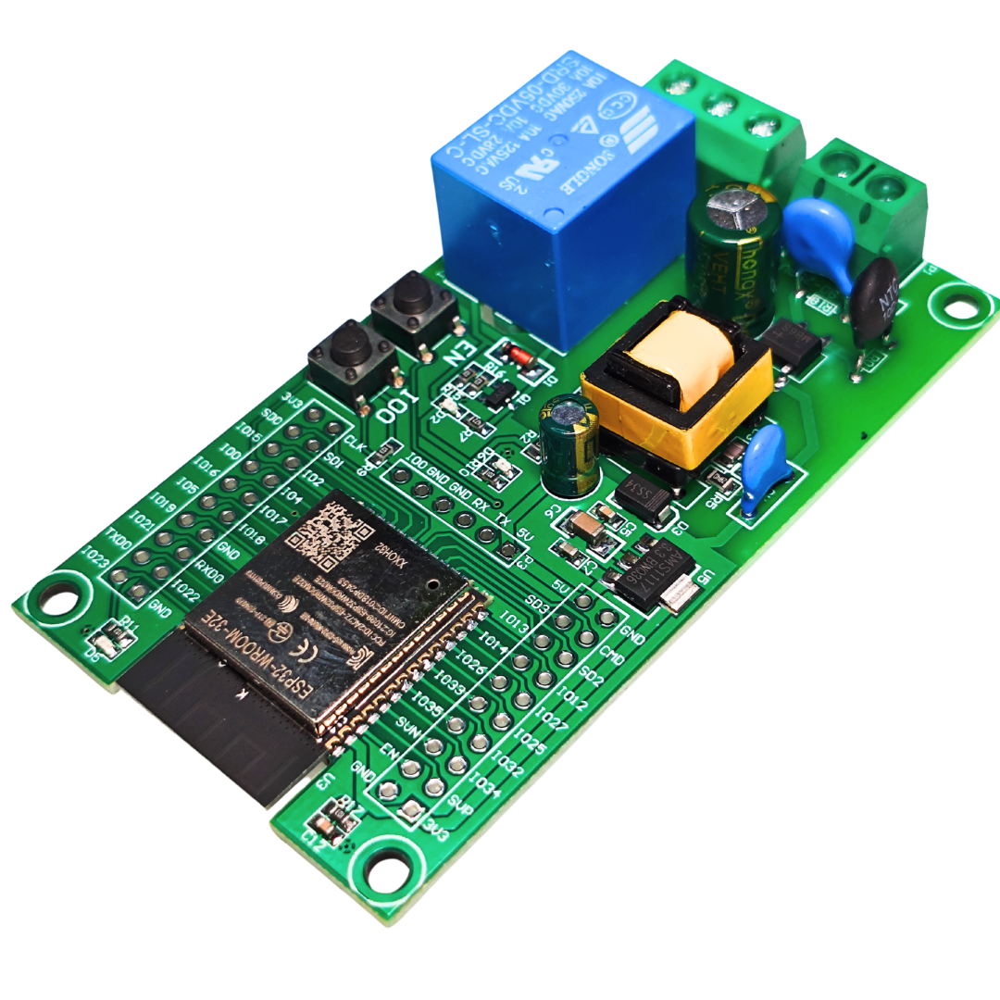

# IoT dan Sensor Networks: Prinsip, Protokol, dan Penerapan

## Materi Kuliah Komprehensif untuk Membentuk Ahli IoT Masa Depan




```
   Lisensi Dokumen:
   Copyright © januari 2025 by Akhmad Hendriawan
   Seluruh dokumen ini dapat digunakan dan disebarkan secara bebas untuk tujuan bukan
   komersial (nonprofit), dengan syarat tidak menghapus atau merubah atribut penulis dan
   pernyataan copyright yang disertakan dalam setiap dokumen. Tidak diperbolehkan melakukan
```

